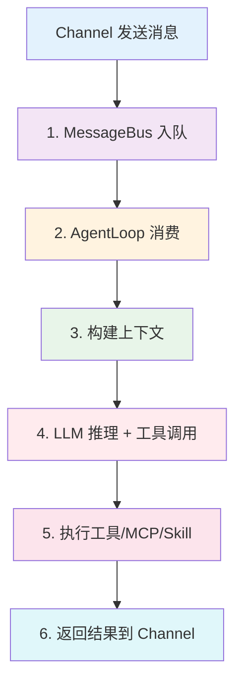
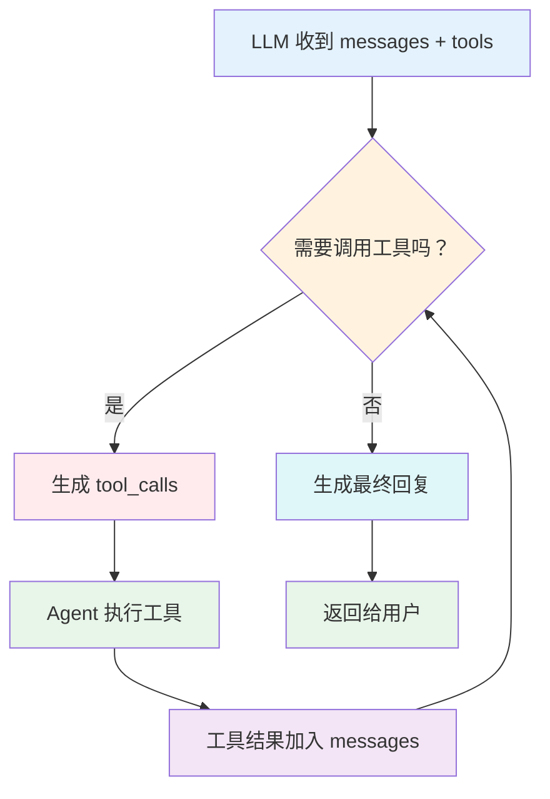
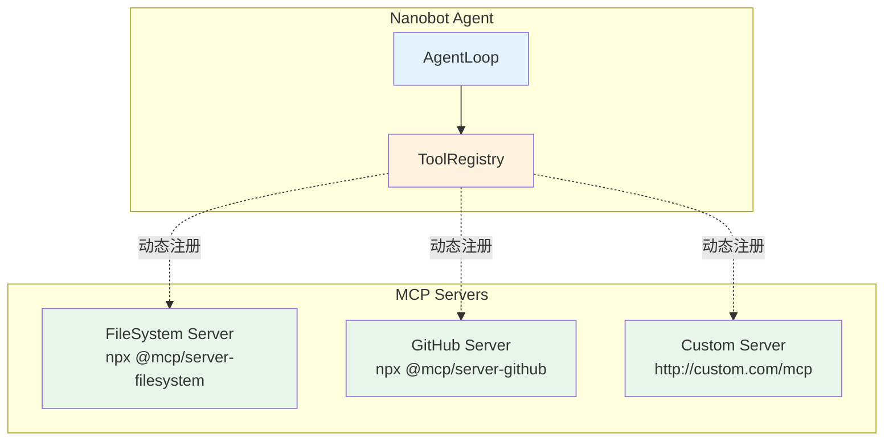
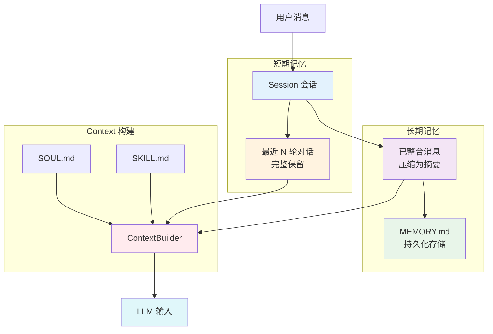
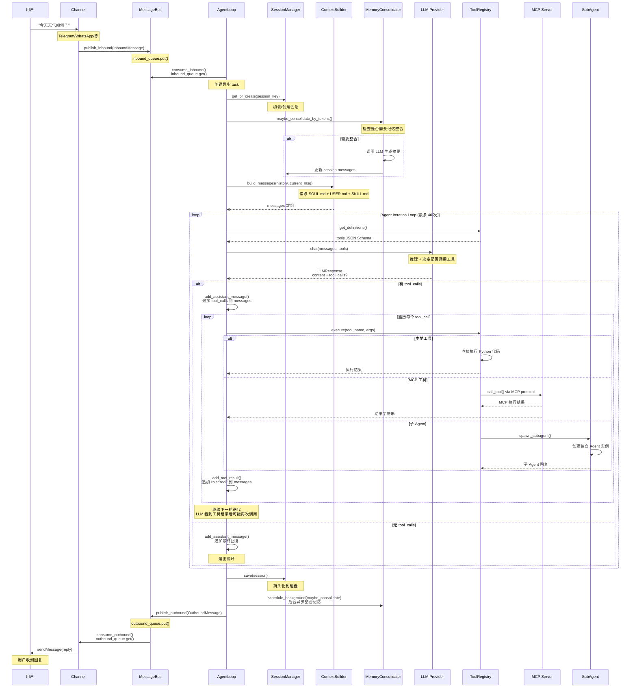

# 🧠 Agent 核心架构与时序详解

## 📋 目录

- [Agent 完整消息处理流程](#agent-完整消息处理流程)
- [Skill 体系与注册机制](#skill-体系与注册机制)
- [LLM 对话与 Tool Calls 对接](#llm 对话与 tool-calls 对接)
- [MCP 服务器集成机制](#mcp 服务器集成机制)
- [Memory 记忆系统协作](#memory 记忆系统协作)
- [完整时序图](#完整时序图)

---

## 🎯 Agent 完整消息处理流程

### 宏观视角：6 个关键阶段



---

### 微观视角：代码级执行流

#### **Stage 1: Channel → MessageBus**

```python
# nanobot/channels/telegram.py
async def _poll_updates(self):
    async with self._session.get(url) as resp:
        updates = await resp.json()
    
    for update in updates.get("result", []):
        msg = InboundMessage(
            channel="telegram",
            sender_id=str(update["message"]["from"]["id"]),
            chat_id=str(update["message"]["chat"]["id"]),
            content=update["message"]["text"],
        )
        
        # 👇 发布到 inbound 队列
        await self.bus.publish_inbound(msg)
```

**关键点**:
- ✅ Channel 只负责**接收和格式化**
- ✅ 统一转换为 `InboundMessage` 对象
- ✅ 发布到 `bus.inbound_queue`

---

#### **Stage 2: AgentLoop 消费消息**

```python
# nanobot/agent/loop.py:256-279
async def run(self) -> None:
    """Run the agent loop, dispatching messages as tasks."""
    self._running = True
    await self._connect_mcp()  # ← 懒加载 MCP 连接
    logger.info("Agent loop started")
    
    while self._running:
        try:
            # 👇 从 inbound_queue 消费
            msg = await asyncio.wait_for(
                self.bus.consume_inbound(), 
                timeout=1.0
            )
        except asyncio.TimeoutError:
            continue
        
        # 特殊命令处理
        cmd = msg.content.strip().lower()
        if cmd == "/stop":
            await self._handle_stop(msg)
        elif cmd == "/restart":
            await self._handle_restart(msg)
        else:
            # 👇 创建异步任务处理
            task = asyncio.create_task(self._dispatch(msg))
            self._active_tasks.setdefault(msg.session_key, []).append(task)
```

**关键点**:
- ✅ **并发处理**: 每个消息一个独立 task
- ✅ **会话隔离**: `session_key` 区分不同对话
- ✅ **可中断**: 支持 `/stop` 取消任务

---

#### **Stage 3: 构建上下文（Context Building）**

```python
# nanobot/agent/loop.py:356-459
async def _process_message(self, msg: InboundMessage) -> OutboundMessage:
    """Process a single inbound message."""
    
    # 1️⃣ 获取或创建会话
    key = msg.session_key  # "telegram:user123"
    session = self.sessions.get_or_create(key)
    
    # 2️⃣ 检查是否需要记忆整合（基于 token 数）
    await self.memory_consolidator.maybe_consolidate_by_tokens(session)
    
    # 3️⃣ 设置工具上下文（路由信息）
    self._set_tool_context(
        msg.channel,      # "telegram"
        msg.chat_id,      # "123456"
        msg.message_id,   # Telegram message ID
    )
    
    # 4️⃣ 获取会话历史
    history = session.get_history(max_messages=0)  # 最近 N 轮对话
    
    # 5️⃣ 构建 LLM 消息数组
    initial_messages = self.context.build_messages(
        history=history,           # [{"role":"user","content":"..."}, ...]
        current_message=msg.content,  # 当前用户消息
        media=msg.media,           # 图片/文件等多媒体
        channel=msg.channel,       # 渠道信息（注入系统提示）
        chat_id=msg.chat_id,       # 聊天 ID（用于路由）
    )
```

---

### **build_messages() 详解**

```python
# nanobot/agent/context.py
class ContextBuilder:
    def build_messages(
        self,
        history: list[dict],
        current_message: str,
        channel: str,
        chat_id: str,
        current_role: str = "user",
    ) -> list[dict]:
        """Build the full message array for LLM."""
        
        # 1️⃣ 读取系统模板（SOUL.md）
        system_prompt = self._load_system_prompt()
        
        # 2️⃣ 读取用户偏好（USER.md）
        user_preferences = self._load_user_preferences()
        
        # 3️⃣ 读取技能文档（skills/*.md）
        skills_docs = self._load_skills()
        
        # 4️⃣ 构建运行时上下文
        runtime_context = {
            "channel": channel,
            "chat_id": chat_id,
            "workspace": str(self.workspace),
            "datetime": datetime.now().isoformat(),
        }
        
        # 5️⃣ 组装完整消息
        messages = [
            {"role": "system", "content": system_prompt},
            {"role": "system", "content": f"User Preferences:\n{user_preferences}"},
            {"role": "system", "content": f"Skills:\n{skills_docs}"},
            {"role": "system", "content": f"Context:\n{json.dumps(runtime_context)}"},
            *history,  # 历史对话
            {"role": current_role, "content": current_message},
        ]
        
        return messages
```

**输出示例**:
```python
messages = [
    {
        "role": "system",
        "content": "You are nanobot, a helpful AI assistant..."
    },
    {
        "role": "system", 
        "content": "User Preferences:\n- Prefer concise answers\n- Use Markdown"
    },
    {
        "role": "system",
        "content": "Skills:\n## cron\nSchedule reminders...\n## memory\nManage long-term memory..."
    },
    {
        "role": "system",
        "content": "Context:\n{\"channel\":\"telegram\",\"chat_id\":\"123456\"...}"
    },
    {"role": "user", "content": "帮我分析这个项目"},  # ← 历史对话 1
    {"role": "assistant", "content": "好的，让我看看..."},  # ← 历史对话 2
    {"role": "user", "content": "今天的天气如何？"}  # ← 当前消息
]
```

---

## 🔧 Skill 体系与注册机制

### **Skill 是什么？**

**定义**: Skill 是预定义的**能力模块**，以 Markdown 文档形式存在。

**位置**: `nanobot/skills/*/SKILL.md`

**示例**:
```markdown
# nanobot/skills/cron/SKILL.md
---
name: cron
description: Schedule reminders and recurring tasks.
---

# Cron

Use the `cron` tool to schedule reminders or recurring tasks.

## Three Modes

1. **Reminder** - message is sent directly to user
2. **Task** - message is a task description, agent executes and sends result
3. **One-time** - runs once at a specific time, then auto-deletes

## Examples

```
cron(action="add", message="Time to take a break!", every_seconds=1200)
```
```

---

### **Skill vs Tool 的区别**

| 维度 | Skill | Tool |
|------|-------|------|
| **形态** | Markdown 文档 | Python 类 |
| **作用** | 教会 LLM 如何使用工具 | 实际执行代码 |
| **注册时机** | 构建上下文时注入 | Agent 初始化时注册 |
| **LLM 感知** | ✅ 通过阅读 SKILL.md | ✅ 通过 tools 参数 |
| **执行能力** | ❌ 无（只是文档） | ✅ 有（可执行代码） |

**关系**:
```
Skill (文档) → 描述功能用法
     ↓
   教会 LLM
     ↓
Tool (代码) → 实际执行功能
```

---

### **Skill 注入流程**

```python
# nanobot/agent/context.py
class ContextBuilder:
    def __init__(self, workspace: Path):
        self.workspace = workspace
        self.skills_dir = workspace / "skills"
        self.builtin_skills_dir = Path(__file__).parent.parent / "skills"
    
    def _load_skills(self) -> str:
        """Load all skill documentation."""
        skills_text = []
        
        # 1️⃣ 加载内置 Skills
        if self.builtin_skills_dir.exists():
            for skill_md in self.builtin_skills_dir.glob("**/SKILL.md"):
                skills_text.append(f"## {skill_md.parent.name}\n{skill_md.read_text()}")
        
        # 2️⃣ 加载用户 Skills
        if self.skills_dir.exists():
            for skill_md in self.skills_dir.glob("**/SKILL.md"):
                skills_text.append(f"## {skill_md.parent.name}\n{skill_md.read_text()}")
        
        return "\n\n".join(skills_text) if skills_text else ""
```

**注入到 LLM**:
```python
messages = [
    {"role": "system", "content": "..."},
    {"role": "system", "content": f"Skills:\n{skills_text}"},  # ← 注入
    ...
]
```

---

### **Tool 注册流程**

```python
# nanobot/agent/loop.py:116-135
class AgentLoop:
    def __init__(self, ...):
        self.tools = ToolRegistry()  # ← 创建工具注册表
        self._register_default_tools()
    
    def _register_default_tools(self) -> None:
        """Register the default set of tools."""
        
        # 1️⃣ 确定工作空间限制
        allowed_dir = self.workspace if self.restrict_to_workspace else None
        
        # 2️⃣ 注册文件操作工具
        self.tools.register(ReadFileTool(
            workspace=self.workspace,
            allowed_dir=allowed_dir,
        ))
        self.tools.register(WriteFileTool(workspace=self.workspace, allowed_dir=allowed_dir))
        self.tools.register(EditFileTool(workspace=self.workspace, allowed_dir=allowed_dir))
        self.tools.register(ListDirTool(workspace=self.workspace, allowed_dir=allowed_dir))
        
        # 3️⃣ 注册 Shell 执行工具
        self.tools.register(ExecTool(
            working_dir=str(self.workspace),
            timeout=self.exec_config.timeout,
            restrict_to_workspace=self.restrict_to_workspace,
        ))
        
        # 4️⃣ 注册 Web 搜索工具
        self.tools.register(WebSearchTool(config=self.web_search_config))
        self.tools.register(WebFetchTool(proxy=self.web_proxy))
        
        # 5️⃣ 注册消息发送工具
        self.tools.register(MessageTool(send_callback=self.bus.publish_outbound))
        
        # 6️⃣ 注册子 Agent 生成工具
        self.tools.register(SpawnTool(manager=self.subagents))
        
        # 7️⃣ 注册定时任务工具
        if self.cron_service:
            self.tools.register(CronTool(self.cron_service))
```

---

### **ToolRegistry 工作原理**

```python
# nanobot/agent/tools/registry.py
class ToolRegistry:
    def __init__(self):
        self._tools: dict[str, Tool] = {}  # name → Tool instance
    
    def register(self, tool: Tool) -> None:
        """Register a tool."""
        self._tools[tool.name] = tool
    
    def get_definitions(self) -> list[dict]:
        """Get all tool definitions in OpenAI format."""
        return [tool.to_schema() for tool in self._tools.values()]
    
    async def execute(self, name: str, params: dict) -> str:
        """Execute a tool by name."""
        tool = self._tools.get(name)
        if not tool:
            return f"Error: Tool '{name}' not found"
        
        # 参数验证和类型转换
        params = tool.cast_params(params)
        errors = tool.validate_params(params)
        if errors:
            return f"Error: {errors}"
        
        # 执行工具
        result = await tool.execute(**params)
        return result
```

---

## 🤖 LLM 对话与 Tool Calls 对接

### **完整的 LLM 交互循环**

```python
# nanobot/agent/loop.py:183-254
async def _run_agent_loop(self, initial_messages: list[dict]) -> tuple[str, list[str], list[dict]]:
    """Run the agent iteration loop. Returns (final_content, tools_used, messages)."""
    
    messages = initial_messages
    iteration = 0
    final_content = None
    tools_used: list[str] = []
    
    while iteration < self.max_iterations:  # 最多 40 次迭代
        iteration += 1
        
        # 1️⃣ 获取所有工具的 JSON Schema
        tool_defs = self.tools.get_definitions()
        
        # 2️⃣ 调用 LLM（带工具定义）
        response = await self.provider.chat_with_retry(
            messages=messages,
            tools=tool_defs,  # ← 关键：告诉 LLM 有哪些工具可用
            model=self.model,
        )
        
        # 3️⃣ 判断是否有工具调用
        if response.has_tool_calls:
            # ── 分支 A: LLM 决定调用工具 ──
            
            # 3a. 显示思考过程和工具提示
            if on_progress:
                thought = self._strip_think(response.content)
                if thought:
                    await on_progress(thought)  # "我需要先查看项目结构"
                
                tool_hint = self._tool_hint(response.tool_calls)
                await on_progress(tool_hint, tool_hint=True)  # "list_dir('...')"
            
            # 3b. 将 Assistant 消息（含 tool_calls）添加到对话
            tool_call_dicts = [tc.to_openai_tool_call() for tc in response.tool_calls]
            messages = self.context.add_assistant_message(
                messages, 
                response.content,
                tool_call_dicts,  # [{id:"call_1", function:{name:"list_dir", arguments:"{...}"}}]
            )
            
            # 3c. **逐个执行工具**
            for tool_call in response.tool_calls:
                tools_used.append(tool_call.name)
                
                # 执行工具并获取结果
                result = await self.tools.execute(tool_call.name, tool_call.arguments)
                
                # 将工具结果添加到对话（作为 role: "tool"）
                messages = self.context.add_tool_result(
                    messages, 
                    tool_call.id,      # 与 tool_call 对应
                    tool_call.name,    # 工具名称
                    result,            # 执行结果
                )
            
            # 3d. 继续循环（LLM 看到工具结果后可能再次调用工具）
            
        else:
            # ── 分支 B: LLM 给出最终回复 ──
            
            clean = self._strip_think(response.content)
            
            if response.finish_reason == "error":
                logger.error("LLM returned error: {}", (clean or "")[:200])
                final_content = clean or "Sorry, I encountered an error."
                break
            
            messages = self.context.add_assistant_message(messages, clean)
            final_content = clean
            break  # 退出循环
    
    return final_content, tools_used, messages
```

---

### **Tool Call 数据结构**

#### **LLM 返回的响应**

```python
# nanobot/providers/base.py
class LLMResponse:
    content: str | None              # LLM 的思考内容
    reasoning_content: str | None    # 推理过程（部分模型支持）
    thinking_blocks: str | None      # <think> 标签内容
    tool_calls: list[ToolCall]       # 工具调用列表
    has_tool_calls: bool             # 是否有工具调用
    finish_reason: str               # "stop" / "tool_calls" / "error"

class ToolCall:
    id: str          # "call_abc123"
    name: str        # "read_file"
    arguments: dict  # {"path": "README.md"}
```

#### **发送给 LLM 的工具定义**

```python
# read_file 工具的 JSON Schema
{
    "type": "function",
    "function": {
        "name": "read_file",
        "description": "Read the entire contents of a file.",
        "parameters": {
            "type": "object",
            "properties": {
                "path": {
                    "type": "string",
                    "description": "Path to the file (relative to workspace)."
                }
            },
            "required": ["path"]
        }
    }
}
```

---

### **LLM 决策树**



---

### **示例：用户问"今天天气如何？"**

```python
# 第 1 轮：LLM 调用 web_search
messages = [
    {"role": "system", "content": "..."},
    {"role": "user", "content": "今天天气如何？"}
]

tools = [
    {"name": "web_search", "description": "...", "parameters": {...}},
    {"name": "read_file", ...},
    ...
]

# LLM 决定调用 web_search
response = {
    "content": "让我查询一下天气信息",
    "tool_calls": [
        ToolCall(
            id="call_1",
            name="web_search",
            arguments={"query": "北京今天天气"},
        )
    ]
}

# Agent 执行工具
result = await tools.execute("web_search", {"query": "北京今天天气"})
# result = "北京今天晴朗，气温 20-28°C，东南风 2 级"

# 将结果加入对话
messages.append({
    "role": "tool",
    "content": result,
    "tool_call_id": "call_1"
})


# 第 2 轮：LLM 生成回复
response = {
    "content": "北京今天晴朗，气温 20-28°C，东南风 2 级。适合户外活动！",
    "has_tool_calls": False
}

# 返回给用户
await bus.publish_outbound(OutboundMessage(
    channel="telegram",
    chat_id="123456",
    content="北京今天晴朗，气温 20-28°C，东南风 2 级。适合户外活动！",
))
```

---

## 🔌 MCP 服务器集成机制

### **什么是 MCP？**

**MCP (Model Context Protocol)**: 一种标准化的协议，用于连接外部工具服务器。

**类比**: 类似于 HTTP API，但专为 LLM 工具调用设计。

---

### **MCP 架构层次**



---

### **MCP 配置与启动**

```python
# config.json
{
  "tools": {
    "mcpServers": {
      "filesystem": {
        "command": "npx",
        "args": ["-y", "@modelcontextprotocol/server-filesystem", "/path/to/dir"],
        "toolTimeout": 30,
        "enabledTools": ["*"]  # 或 ["read_file", "write_file"]
      },
      "github": {
        "command": "npx",
        "args": ["-y", "@modelcontextprotocol/server-github"],
        "env": {
          "GITHUB_PERSONAL_ACCESS_TOKEN": "ghp_xxxxx"
        }
      },
      "remote-mcp": {
        "url": "https://mcp.example.com/sse",
        "headers": {
          "Authorization": "Bearer xxxxx"
        }
      }
    }
  }
}
```

---

### **MCP 连接流程**

```python
# nanobot/agent/loop.py:136-157
class AgentLoop:
    async def _connect_mcp(self) -> None:
        """Connect to configured MCP servers (one-time, lazy)."""
        
        # 1️⃣ 幂等检查：已连接或正在连接则跳过
        if self._mcp_connected or self._mcp_connecting or not self._mcp_servers:
            return
        
        self._mcp_connecting = True
        
        from nanobot.agent.tools.mcp import connect_mcp_servers
        
        try:
            # 2️⃣ 创建 AsyncExitStack（管理资源生命周期）
            self._mcp_stack = AsyncExitStack()
            await self._mcp_stack.__aenter__()
            
            # 3️⃣ 连接所有 MCP 服务器并注册工具
            await connect_mcp_servers(
                self._mcp_servers,  # config.json 中的配置
                self.tools,         # ToolRegistry
                self._mcp_stack,    # 资源管理器
            )
            
            self._mcp_connected = True
            logger.info("MCP servers connected")
            
        except BaseException as e:
            logger.error("Failed to connect MCP servers: {}", e)
            # 清理失败的资源
            if self._mcp_stack:
                await self._mcp_stack.aclose()
                self._mcp_stack = None
        finally:
            self._mcp_connecting = False
```

---

### **connect_mcp_servers() 详解**

```python
# nanobot/agent/tools/mcp.py:42-184
async def connect_mcp_servers(
    mcp_servers: dict,
    registry: ToolRegistry,
    stack: AsyncExitStack,
) -> None:
    """Connect to MCP servers and register their tools."""
    
    for name, cfg in mcp_servers.items():
        # 1️⃣ 判断传输类型
        transport_type = cfg.type
        if not transport_type:
            if cfg.command:
                transport_type = "stdio"  # 本地进程
            elif cfg.url:
                transport_type = "sse" if cfg.url.endswith("/sse") else "streamableHttp"
        
        # 2️⃣ 根据传输类型建立连接
        if transport_type == "stdio":
            # Stdio 模式：启动子进程
            params = StdioServerParameters(
                command=cfg.command,  # "npx"
                args=cfg.args,        # ["-y", "@mcp/server-filesystem", "/dir"]
                env=cfg.env or {},    # 环境变量
            )
            read, write = await stack.enter_async_context(stdio_client(params))
        
        elif transport_type == "sse":
            # SSE 模式：HTTP Server-Sent Events
            read, write = await stack.enter_async_context(
                sse_client(cfg.url, httpx_client_factory=...)
            )
        
        elif transport_type == "streamableHttp":
            # Streamable HTTP 模式
            http_client = await stack.enter_async_context(
                httpx.AsyncClient(headers=cfg.headers, follow_redirects=True)
            )
            read, write, _ = await stack.enter_async_context(
                streamable_http_client(cfg.url, http_client=http_client)
            )
        
        # 3️⃣ 创建 MCP ClientSession
        session = await stack.enter_async_context(
            ClientSession(read, write)
        )
        
        # 4️⃣ 初始化会话
        await session.initialize()
        
        # 5️⃣ 获取服务器提供的工具列表
        tools_response = await session.list_tools()
        
        # 6️⃣ 过滤并注册工具
        for tool in tools_response.tools:
            # enabledTools 过滤
            if cfg.enabled_tools and "*" not in cfg.enabled_tools:
                if tool.name not in cfg.enabled_tools:
                    continue
            
            # 创建 MCPTool 包装器
            mcp_tool = MCPTool(
                name=f"mcp_{name}_{tool.name}",  # 避免命名冲突
                description=tool.description,
                input_schema=tool.inputSchema,
                session=session,
                timeout=cfg.tool_timeout or 30,
            )
            
            # 注册到 ToolRegistry
            registry.register(mcp_tool)
            logger.info("Registered MCP tool: {}", mcp_tool.name)
```

---

### **MCPTool 执行流程**

```python
# nanobot/agent/tools/mcp.py
class MCPTool(Tool):
    def __init__(
        self,
        name: str,
        description: str,
        input_schema: dict,
        session: ClientSession,
        timeout: int = 30,
    ):
        self.name = name
        self.description = description
        self.input_schema = input_schema
        self.session = session
        self.timeout = timeout
    
    def to_schema(self) -> dict:
        """Convert to OpenAI tool schema."""
        return {
            "type": "function",
            "function": {
                "name": self.name,
                "description": self.description,
                "parameters": self.input_schema,
            }
        }
    
    async def execute(self, **kwargs) -> str:
        """Execute the MCP tool via MCP protocol."""
        try:
            # 通过 MCP 协议调用远程工具
            result = await asyncio.wait_for(
                self.session.call_tool(self.name, kwargs),
                timeout=self.timeout,
            )
            
            # 解析结果
            if result.is_error:
                return f"MCP Error: {result.content}"
            
            # MCP 返回的是 Content 数组，提取文本
            texts = [c.text for c in result.content if hasattr(c, "text")]
            return "\n".join(texts) if texts else str(result)
            
        except asyncio.TimeoutError:
            return f"Error: MCP tool '{self.name}' timed out after {self.timeout}s"
```

---

### **MCP 工具使用示例**

```python
# 用户："列出当前目录"
# Agent 调用 MCP FileSystem 工具

# 1️⃣ LLM 决定调用 mcp_filesystem_list_dir
response = {
    "tool_calls": [
        ToolCall(
            id="call_mcp_1",
            name="mcp_filesystem_list_dir",
            arguments={"path": "."},
        )
    ]
}

# 2️⃣ Agent 执行 MCP 工具
mcp_tool = registry.get("mcp_filesystem_list_dir")
result = await mcp_tool.execute(path=".")

# 3️⃣ MCP 协议内部流程
# MCPTool.execute() → session.call_tool() → stdio/sse 传输 → MCP Server 执行 → 返回结果

# 4️⃣ MCP Server 返回
result = "[\n  'README.md',\n  'src/',\n  'tests/'\n]"

# 5️⃣ 将结果送回给 LLM
messages.append({
    "role": "tool",
    "content": result,
    "tool_call_id": "call_mcp_1"
})

# 6️⃣ LLM 生成回复
response = {
    "content": "当前目录包含：\n- README.md\n- src/ 目录\n- tests/ 目录"
}
```

---

## 🧠 Memory 记忆系统协作

### **Memory Consolidation 机制**

```python
# nanobot/agent/memory.py
class MemoryConsolidator:
    """
    Compress conversation历史到长期记忆。
    
    触发条件:
    1. 对话轮数超过阈值
    2. Token 数超过阈值
    """
    
    async def maybe_consolidate_by_tokens(self, session: Session) -> None:
        """Check if consolidation is needed based on token count."""
        
        # 1️⃣ 计算当前会话的 token 数
        total_tokens = self._count_tokens(session.messages)
        
        # 2️⃣ 判断是否超过阈值（context_window_tokens 的 70%）
        threshold = self.context_window_tokens * 0.7
        
        if total_tokens > threshold:
            logger.info("Token limit exceeded ({} > {}), consolidating...", 
                       total_tokens, threshold)
            
            # 3️⃣ 执行记忆整合
            await self.consolidate(session)
    
    async def consolidate(self, session: Session) -> None:
        """Compress old messages into a summary."""
        
        # 1️⃣ 提取需要整合的消息（last_consolidated 之后）
        messages_to_summarize = session.messages[session.last_consolidated:]
        
        # 2️⃣ 调用 LLM 生成摘要
        summary = await self._generate_summary(messages_to_summarize)
        
        # 3️⃣ 替换原始消息
        session.messages = [
            *session.messages[:session.last_consolidated],
            {"role": "system", "content": f"[Summary]\n{summary}"},
        ]
        
        # 4️⃣ 更新指针
        session.last_consolidated = len(session.messages) - 1
        
        # 5️⃣ 保存到 MEMORY.md（长期记忆）
        await self.archive_to_memory(summary)
        
        # 6️⃣ 保存会话
        self.sessions.save(session)
```

---

### **Memory 与 Context 的关系**



---

## 📊 完整时序图

### **端到端消息处理全流程**



---

## 🎯 关键设计模式总结

### **1. 依赖注入 (Dependency Injection)**

```python
# AgentLoop 不自己创建依赖，而是通过构造函数注入
agent = AgentLoop(
    bus=bus,              # ← 外部注入 MessageBus
    provider=provider,    # ← 外部注入 LLMProvider
    session_manager=sessions,  # ← 外部注入 SessionManager
    cron_service=cron,    # ← 外部注入 CronService
    ...
)
```

**优点**:
- ✅ 易于测试（可以 Mock）
- ✅ 松耦合
- ✅ 灵活替换实现

---

### **2. 策略模式 (Strategy Pattern)**

```python
# Tool 接口定义
class Tool(ABC):
    @abstractmethod
    def to_schema(self) -> dict: ...
    
    @abstractmethod
    async def execute(self, **kwargs) -> str: ...

# 多种实现
class ReadFileTool(Tool): ...
class WebSearchTool(Tool): ...
class MCPTool(Tool): ...  # ← MCP 适配器
```

**优点**:
- ✅ 统一接口
- ✅ 易于扩展新工具
- ✅ LLM 无需关心具体实现

---

### **3. 观察者模式 (Observer Pattern)**

```python
# MessageBus 作为事件中心
class MessageBus:
    async def publish_inbound(self, msg):
        await self.inbound_queue.put(msg)  # ← 发布事件
    
    async def consume_inbound(self):
        return await self.inbound_queue.get()  # ← 订阅者消费
```

**优点**:
- ✅ 解耦生产者和消费者
- ✅ 支持背压（Backpressure）
- ✅ 异步非阻塞

---

### **4. 装饰器模式 (Decorator Pattern)**

```python
# MCPTool 装饰原生 MCP 工具
class MCPTool(Tool):
    def __init__(self, session, ...):
        self.session = session  # ← 被装饰的原生对象
    
    async def execute(self, **kwargs):
        # 添加超时控制、错误处理等额外逻辑
        result = await asyncio.wait_for(
            self.session.call_tool(...),
            timeout=self.timeout,
        )
        return result
```

**优点**:
- ✅ 不修改原有代码
- ✅ 动态添加功能
- ✅ 符合开闭原则

---

### **5. 单例模式 (Singleton Pattern)**

```python
# ToolRegistry 在整个 Agent 生命周期中只有一个实例
class AgentLoop:
    def __init__(self):
        self.tools = ToolRegistry()  # ← 单例
```

**优点**:
- ✅ 全局唯一
- ✅ 节省资源
- ✅ 易于访问

---

## 📝 总结

### **Agent 核心职责**

1. ✅ **消息调度**: 从 Bus 接收 → 处理 → 返回 Bus
2. ✅ **上下文构建**: 组合历史、记忆、技能、系统提示
3. ✅ **LLM 协调**: 调用→等待→解析→迭代
4. ✅ **工具执行**: 本地工具 + MCP 工具 + 子 Agent
5. ✅ **记忆管理**: 整合、归档、持久化

---

### **关键协作关系**

```
AgentLoop (指挥官)
    ↓
ContextBuilder (军师) → 组装情报（历史 + 记忆 + 技能）
    ↓
LLM Provider (大脑) → 决策（是否调用工具）
    ↓
ToolRegistry (武器库) → 提供工具
    ↓
├─ 本地工具 (刀剑) → 直接执行
├─ MCP 工具 (枪械) → 远程调用
└─ 子 Agent (援军) → 委托任务
```

---

### **性能优化点**

| 优化 | 实现方式 |
|------|---------|
| **懒加载 MCP** | 第一次收到消息时才连接 |
| **背景记忆整合** | 不阻塞主流程，异步执行 |
| **并发任务处理** | 每个消息独立 task，互不阻塞 |
| **工具结果截断** | 防止超大结果污染上下文 |
| **迭代次数限制** | 防止无限工具调用循环 |

---

现在你完全理解了 Agent 的完整架构和协作机制！🎉
