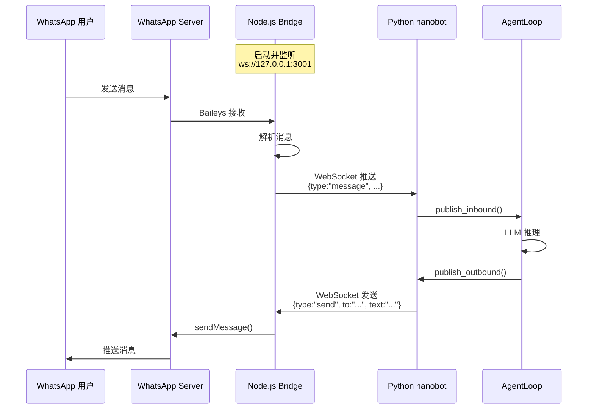

# 🌉 Bridge 架构详解与 Channel 接入指南

## 📋 目录

- [Bridge 目录核心作用](#bridge 目录核心作用)
- [Bridge 架构深度解析](#bridge 架构深度解析)
- [Channel 接入方式分类](#channel 接入方式分类)
- [接入钉钉/飞书/企业微信需要修改 Bridge 吗？](#接入钉钉飞书企业微信需要修改 bridge 吗)
- [自定义 Channel 开发指南](#自定义 channel 开发指南)

---

## 🎯 Bridge 目录核心作用

### **Bridge 是什么？**

**定义**: Bridge 是一个 **Node.js 编写的 WhatsApp 协议桥接服务**，用于连接 WhatsApp Web 和 Python 后端。

**位置**: `nanobot-plus/bridge/`

**核心价值**: 
- ✅ **协议转换**: WhatsApp Web → WebSocket → Python
- ✅ **依赖隔离**: Node.js 依赖（Baileys）不影响 Python 环境
- ✅ **双向通信**: 接收消息 + 发送消息

---

### **为什么需要 Bridge？**

#### **问题：WhatsApp 没有官方 Bot API**

```
┌─────────────────┐         ❌ 无法直接连接          ┌─────────────────┐
│   Python        │                                 │   WhatsApp      │
│   nanobot       │ ←──────────────────X──────────→ │   Servers       │
│   (asyncio)     │      WhatsApp Web Protocol      │   (加密协议)     │
└─────────────────┘                                 └─────────────────┘
```

**技术障碍**:
1. ❌ WhatsApp 使用专有加密协议（非 HTTP/REST）
2. ❌ 需要 WebSocket 长连接 + 复杂认证
3. ❌ 主流 SDK 都是 Node.js（baileys、whatsapp-web.js）
4. ❌ Python SDK 不成熟或已废弃

---

#### **解决方案：Bridge 架构**

```
┌─────────────────┐      WebSocket       ┌─────────────────┐
│   Python        │ ←──────────────────→ │   Node.js       │
│   nanobot       │    ws://localhost:3001 │   Bridge        │
│   (asyncio)     │    JSON messages     │   (Baileys)     │
└─────────────────┘                      └────────┬────────┘
                                                  │
                                                  │ WhatsApp Web
                                                  ↓
                                          ┌─────────────────┐
                                          │   WhatsApp      │
                                          │   Servers       │
                                          └─────────────────┘
```

**优势**:
- ✅ **Python 专注业务逻辑**: 不用处理复杂协议
- ✅ **Node.js 处理底层**: Baileys 是最成熟的 WhatsApp Web SDK
- ✅ **松耦合**: 通过 WebSocket 通信，可独立升级
- ✅ **安全性**: Bridge 只监听 `127.0.0.1`，不暴露到公网

---

## 🏗️ Bridge 架构深度解析

### **文件结构**

```
bridge/
├── src/
│   ├── index.ts          # 入口文件（启动服务器）
│   ├── server.ts         # WebSocket 服务器
│   └── whatsapp.ts       # WhatsApp 客户端（Baileys 包装）
├── package.json          # Node.js 依赖配置
└── tsconfig.json         # TypeScript 配置
```

---

### **核心组件详解**

#### **1. index.ts - 启动入口**

```typescript
#!/usr/bin/env node
/**
 * nanobot WhatsApp Bridge
 * 
 * Usage:
 *   npm run build && npm start
 *   
 * Or with custom settings:
 *   BRIDGE_PORT=3001 AUTH_DIR=~/.nanobot/whatsapp npm start
 */

// 环境变量配置
const PORT = parseInt(process.env.BRIDGE_PORT || '3001', 10);
const AUTH_DIR = process.env.AUTH_DIR || join(homedir(), '.nanobot', 'whatsapp-auth');
const TOKEN = process.env.BRIDGE_TOKEN || undefined;

// 创建并启动服务器
const server = new BridgeServer(PORT, AUTH_DIR, TOKEN);
await server.start();
```

**职责**:
- ✅ 读取环境变量（端口、认证目录、Token）
- ✅ 创建 BridgeServer 实例
- ✅ 处理进程信号（SIGINT/SIGTERM）
- ✅ 优雅关闭服务

---

#### **2. server.ts - WebSocket 服务器**

```typescript
export class BridgeServer {
  private wss: WebSocketServer | null = null;
  private wa: WhatsAppClient | null = null;
  private clients: Set<WebSocket> = new Set();

  async start(): Promise<void> {
    // 1️⃣ 绑定到 localhost（安全！）
    this.wss = new WebSocketServer({ 
      host: '127.0.0.1',  // ← 关键：不暴露到公网
      port: this.port 
    });

    // 2️⃣ 初始化 WhatsApp 客户端
    this.wa = new WhatsAppClient({
      authDir: this.authDir,
      onMessage: (msg) => this.broadcast({ type: 'message', ...msg }),
      onQR: (qr) => this.broadcast({ type: 'qr', qr }),
      onStatus: (status) => this.broadcast({ type: 'status', status }),
    });

    // 3️⃣ 处理 WebSocket 连接
    this.wss.on('connection', (ws) => {
      if (this.token) {
        // Token 认证握手
        ws.once('message', (data) => {
          const msg = JSON.parse(data.toString());
          if (msg.type === 'auth' && msg.token === this.token) {
            this.setupClient(ws);  // 认证成功
          } else {
            ws.close(4003, 'Invalid token');
          }
        });
      } else {
        this.setupClient(ws);  // 无需认证
      }
    });

    // 4️⃣ 连接 WhatsApp
    await this.wa.connect();
  }
}
```

**关键设计**:

| 设计决策 | 作用 | 安全影响 |
|---------|------|---------|
| **host: '127.0.0.1'** | 仅本地访问 | ✅ 防止远程攻击 |
| **BRIDGE_TOKEN** | 可选认证 | ✅ 防止未授权访问 |
| **广播模式** | 支持多个 Python 客户端 | ⚠️ 需控制连接数 |

---

#### **3. whatsapp.ts - WhatsApp 客户端**

```typescript
export class WhatsAppClient {
  private sock: any = null;
  private options: WhatsAppClientOptions;

  async connect(): Promise<void> {
    // 使用 Baileys SDK 连接 WhatsApp
    const { state, saveCreds } = await useMultiFileAuthState(this.options.authDir);
    
    this.sock = makeWASocket({
      auth: {
        creds: state.creds,
        keys: makeCacheableSignalKeyStore(state.keys, logger),
      },
      version: latestVersion,
      browser: ['nanobot', 'cli', '0.1.0'],
      printQRInTerminal: false,  // ← 我们自己显示 QR
    });

    // 监听事件
    this.sock.ev.on('connection.update', async (update) => {
      const { connection, qr } = update;

      if (qr) {
        // 显示二维码供用户扫描
        qrcode.generate(qr, { small: true });
        this.options.onQR(qr);  // ← 通知 Python 端
      }

      if (connection === 'close') {
        // 断线重连逻辑
        const shouldReconnect = statusCode !== DisconnectReason.loggedOut;
        if (shouldReconnect) {
          setTimeout(() => this.connect(), 5000);
        }
      }
    });

    // 监听消息
    this.sock.ev.on('messages.upsert', async ({ messages }) => {
      for (const msg of messages) {
        const parsed = this.parseMessage(msg);
        this.options.onMessage(parsed);  // ← 通知 Python 端
      }
    });
  }

  async sendMessage(to: string, text: string): Promise<void> {
    // 发送消息到 WhatsApp
    await this.sock.sendMessage(to, { text });
  }
}
```

**核心功能**:
- ✅ **认证管理**: 保存会话凭证到 `~/.nanobot/whatsapp-auth/`
- ✅ **二维码显示**: 终端打印二维码供用户扫描
- ✅ **自动重连**: 断线后 5 秒重试
- ✅ **消息解析**: 提取文本、图片、语音等
- ✅ **去重处理**: 避免重复处理同一条消息

---

### **通信协议详解**

#### **消息格式**

##### **Python → Node.js (发送消息)**

```json
{
  "type": "send",
  "to": "8613800000000",
  "text": "Hello from nanobot!"
}
```

**字段说明**:
- `type`: `"send"` （固定）
- `to`: 收件人手机号（带国家代码）
- `text`: 消息内容

---

##### **Node.js → Python (接收消息)**

```json
{
  "type": "message",
  "id": "msg_abc123",
  "sender": "8613800000000@s.whatsapp.net",
  "pn": "8613800000000",
  "content": "Hello!",
  "timestamp": 1741478400000,
  "isGroup": false,
  "media": []
}
```

**字段说明**:
- `type`: `"message"` / `"status"` / `"qr"` / `"error"`
- `sender`: WhatsApp 用户 ID（带域）
- `pn`: 纯手机号（方便 Python 端处理）
- `content`: 消息文本
- `media`: 媒体文件路径数组（如果有）

---

##### **Node.js → Python (状态通知)**

```json
// 二维码就绪
{
  "type": "qr",
  "qr": "https://api.whatsapp.com/qr/ABC123..."
}

// 连接状态
{
  "type": "status",
  "status": "connected"  // 或 "disconnected" / "auth_failed"
}
```

---

### **完整消息流**



---

## 📡 Channel 接入方式分类

### **三大类 Channel**

根据**连接方式**和**协议复杂度**，Channel 分为三类：

| 类型 | 代表 Channel | 连接方式 | 是否需要 Bridge |
|------|-------------|---------|---------------|
| **HTTP Bot API** | Telegram, DingTalk | HTTP 轮询/Webhook | ❌ 不需要 |
| **WebSocket 长连接** | Feishu, WeCom, Slack | SDK 内置 WS | ❌ 不需要 |
| **专有协议** | WhatsApp | 加密 WebSocket | ✅ 需要 Bridge |

---

### **类型 1: HTTP Bot API**

**特点**:
- ✅ 官方提供 REST API
- ✅ 简单轮询或 Webhook
- ✅ Python SDK 成熟
- ❌ 需要公网 IP（Webhook 模式）

**代表**:
- **Telegram Bot API**: `https://api.telegram.org/bot<TOKEN>/getUpdates`
- **DingTalk**: 钉钉开放平台 API

**实现示例**（DingTalk）:

```python
# nanobot/channels/dingtalk.py
class DingTalkChannel(BaseChannel):
    async def start(self):
        # 1. 使用官方 SDK 连接 Stream
        credential = Credential(self.config.client_id, self.config.client_secret)
        client = DingTalkStreamClient(credential)
        
        # 2. 注册回调
        client.register_callback_handler(ChatbotMessage.TOPIC, handler)
        
        # 3. 启动（SDK 内部处理 WebSocket）
        await client.start()
    
    async def send(self, msg: OutboundMessage):
        # 4. 直接调用 HTTP API 发送
        await self._http.post(
            "https://api.dingtalk.com/v1.0/robot/oToMessages/send",
            json={"receiver": msg.chat_id, "content": {...}}
        )
```

**无需 Bridge**:
- ✅ 直接用 Python SDK
- ✅ 官方库处理所有协议细节

---

### **类型 2: WebSocket 长连接**

**特点**:
- ✅ 官方 SDK 支持 WebSocket
- ✅ 无需公网 IP
- ✅ Python SDK 可用
- ❌ 需要保持长连接

**代表**:
- **Feishu (飞书)**: `lark-oapi` SDK
- **WeCom (企业微信)**: `wecom_aibot_sdk`
- **Slack**: `slack_sdk` Socket Mode

**实现示例**（Feishu）:

```python
# nanobot/channels/feishu.py
class FeishuChannel(BaseChannel):
    async def start(self):
        # 1. 使用官方 SDK
        self._client = Client.builder() \
            .app_id(self.config.app_id) \
            .app_secret(self.config.app_secret) \
            .build()
        
        # 2. 创建 WebSocket 客户端
        self._ws_client = ws.Client.builder() \
            .app_id(self.config.app_id) \
            .app_secret(self.config.app_secret) \
            .build()
        
        # 3. 在独立线程中运行（SDK 要求）
        def run_ws():
            while self._running:
                self._ws_client.start()  # 阻塞直到断开
        
        threading.Thread(target=run_ws, daemon=True).start()
    
    async def send(self, msg: OutboundMessage):
        # 4. 调用 SDK 发送消息
        self._client.im.v1.message.create(...)
```

**无需 Bridge**:
- ✅ SDK 已经封装好 WebSocket
- ✅ Python 原生支持 threading

---

### **类型 3: 专有协议**

**特点**:
- ❌ 无官方 Bot API
- ❌ 协议复杂（加密、认证）
- ❌ Python SDK 不成熟
- ✅ Node.js 有成熟方案
- ✅ **必须用 Bridge**

**代表**:
- **WhatsApp**: Baileys (@whiskeysockets/baileys)
- **微信 (个人号)**: wechaty (需 Node.js)

**为什么必须用 Bridge**:

```python
# ❌ 如果强行用 Python
import asyncio
import websockets

# Python 需要自己处理：
# 1. WhatsApp Web 加密协议
# 2. 二维码生成和扫描
# 3. 会话凭证管理
# 4. 心跳保活
# 5. 断线重连
# ... 极其复杂！

# ✅ 正确做法：交给 Node.js
# bridge/whatsapp.ts 已经全部实现好了
```

---

## 🔧 接入钉钉/飞书/企业微信需要修改 Bridge 吗？

### **答案：❌ 不需要！**

**原因**:
1. ✅ Bridge **专为 WhatsApp 设计**，不通用
2. ✅ 钉钉/飞书/企业微信都有 **Python SDK**
3. ✅ Channel 代码在 `nanobot/channels/` 目录
4. ✅ 每个 Channel **独立实现**，互不影响

---

### **架构对比**

```
┌─────────────────────────────────────────────────────┐
│                 nanobot gateway                     │
├─────────────────────────────────────────────────────┤
│                                                     │
│  ┌───────────────┐  ┌───────────────┐              │
│  │ DingTalkChan  │  │ FeishuChannel│              │
│  │ (Python)      │  │ (Python)      │              │
│  │               │  │               │              │
│  │ SDK:          │  │ SDK:          │              │
│  │ dingtalk-stream│ │ lark-oapi     │              │
│  └───────┬───────┘  └───────┬───────┘              │
│          │                  │                       │
│          │ HTTP/WS          │ HTTP/WS              │
│          ↓                  ↓                       │
│  ┌───────────────┐  ┌───────────────┐              │
│  │ DingTalk      │  │ Feishu        │              │
│  │ Servers       │  │ Servers       │              │
│  └───────────────┘  └───────────────┘              │
│                                                     │
│                          ┌───────────────────────┐  │
│                          │ WhatsAppChannel       │  │
│                          │ (Python)              │  │
│                          │                       │  │
│                          │ WebSocket             │  │
│                          │ ws://localhost:3001   │  │
│                          └───────────┬───────────┘  │
│                                      │              │
│                              ┌───────▼───────┐      │
│                              │ Node.js Bridge│      │
│                              │ (Baileys)     │      │
│                              └───────┬───────┘      │
│                                      │              │
│                              ┌───────▼───────┐      │
│                              │ WhatsApp      │      │
│                              │ Servers       │      │
│                              └───────────────┘      │
└─────────────────────────────────────────────────────┘
```

**关键点**:
- ✅ DingTalk/Feishu/WeCom **直连**，不经过 Bridge
- ✅ WhatsApp **必须经过** Bridge
- ✅ 所有 Channel 最终都连接到 **同一个 MessageBus**

---

### **实际配置示例**

#### **启用钉钉**

```json
// config.json
{
  "channels": {
    "dingtalk": {
      "enabled": true,
      "clientId": "your_client_id",
      "clientSecret": "your_client_secret",
      "allowFrom": ["*"]
    }
  }
}

// 启动
nanobot gateway
// ✅ 自动启动 DingTalkChannel（Python）
// ❌ 不涉及 Bridge
```

---

#### **启用飞书**

```json
// config.json
{
  "channels": {
    "feishu": {
      "enabled": true,
      "appId": "cli_xxx",
      "appSecret": "xxx",
      "allowFrom": ["ou_xxx"]
    }
  }
}

// 启动
nanobot gateway
// ✅ 自动启动 FeishuChannel（Python）
// ❌ 不涉及 Bridge
```

---

#### **启用企业微信**

```json
// config.json
{
  "channels": {
    "wecom": {
      "enabled": true,
      "botId": "your_bot_id",
      "secret": "your_secret",
      "allowFrom": ["*"]
    }
  }
}

// 启动
nanobot gateway
// ✅ 自动启动 WeComChannel（Python）
// ❌ 不涉及 Bridge
```

---

#### **启用 WhatsApp**

```json
// config.json
{
  "channels": {
    "whatsapp": {
      "enabled": true,
      "bridgeUrl": "ws://localhost:3001",
      "bridgeToken": "your_token",
      "allowFrom": ["+1234567890"]
    }
  }
}

// 启动（需要两个终端）
// 终端 1: 启动 Bridge
cd bridge && npm run build && npm start

// 终端 2: 启动 Gateway
nanobot gateway
// ✅ WhatsAppChannel 连接 Bridge
// ✅ Bridge 连接 WhatsApp
```

---

## 🛠️ 自定义 Channel 开发指南

### **何时需要自定义 Channel？**

✅ **场景 1: 新增平台**
- 公司自研 IM 系统
- 小众聊天工具
- 特定行业通讯软件

✅ **场景 2: 特殊需求**
- 现有 Channel 功能不满足
- 需要定制消息格式
- 性能优化需求

---

### **开发步骤**

#### **Step 1: 创建 Channel 文件**

```bash
# 在 nanobot/channels/ 目录创建
touch nanobot/channels/mychannel.py
```

**文件结构**:
```python
"""MyChannel implementation."""

import asyncio
from typing import Any

from loguru import logger

from nanobot.bus.events import OutboundMessage
from nanobot.bus.queue import MessageBus
from nanobot.channels.base import BaseChannel
from nanobot.config.schema import Base


class MyChannelConfig(Base):
    """MyChannel configuration."""
    
    enabled: bool = False
    api_key: str = ""
    allow_from: list[str] = []


class MyChannel(BaseChannel):
    """MyChannel implementation."""
    
    name = "mychannel"
    display_name = "MyChannel"
    
    @classmethod
    def default_config(cls) -> dict[str, Any]:
        return MyChannelConfig().model_dump(by_alias=True)
    
    def __init__(self, config: Any, bus: MessageBus):
        if isinstance(config, dict):
            config = MyChannelConfig.model_validate(config)
        super().__init__(config, bus)
        self.config: MyChannelConfig = config
        self._client = None
    
    async def start(self) -> None:
        """Start the channel."""
        if not self.config.api_key:
            logger.error("API key not configured")
            return
        
        self._running = True
        
        # TODO: 实现连接逻辑
        # 1. 初始化客户端
        # 2. 连接服务器
        # 3. 注册消息处理器
        # 4. 保持运行
        
        while self._running:
            await asyncio.sleep(1)
    
    async def stop(self) -> None:
        """Stop the channel."""
        self._running = False
        if self._client:
            await self._client.disconnect()
    
    async def send(self, msg: OutboundMessage) -> None:
        """Send a message."""
        # TODO: 实现发送逻辑
        if not self._client:
            logger.warning("Client not connected")
            return
        
        try:
            # 调用 SDK/API 发送
            await self._client.send_message(
                to=msg.chat_id,
                text=msg.content,
            )
        except Exception as e:
            logger.error("Error sending message: {}", e)
    
    # TODO: 实现消息接收处理器
    # def _on_message(self, data):
    #     # 解析消息
    #     # 发布到 MessageBus
    #     await self.bus.publish_inbound(InboundMessage(...))
```

---

#### **Step 2: 注册 Channel**

**方式 1: 自动发现（推荐）**

```python
# nanobot/channels/registry.py
def discover_all() -> dict[str, type]:
    """Discover all available channels."""
    channels = {}
    
    # 内置 Channel
    from nanobot.channels.telegram import TelegramChannel
    from nanobot.channels.feishu import FeishuChannel
    from nanobot.channels.mychannel import MyChannel  # ← 添加你的
    
    channels["telegram"] = TelegramChannel
    channels["feishu"] = FeishuChannel
    channels["mychannel"] = MyChannel  # ← 注册
    
    return channels
```

---

**方式 2: 配置文件注入**

```python
# nanobot/cli/commands.py
def _onboard_plugins(config_path: Path) -> None:
    """Inject default config for all discovered channels."""
    from nanobot.channels.registry import discover_all
    
    all_channels = discover_all()
    
    with open(config_path, encoding="utf-8") as f:
        data = json.load(f)
    
    channels = data.setdefault("channels", {})
    
    for name, cls in all_channels.items():
        if name not in channels:
            channels[name] = cls.default_config()  # ← 自动注入默认配置
    
    with open(config_path, "w", encoding="utf-8") as f:
        json.dump(data, f, indent=2, ensure_ascii=False)
```

---

#### **Step 3: 测试 Channel**

```python
# tests/test_mychannel.py
import pytest
from nanobot.channels.mychannel import MyChannel, MyChannelConfig
from nanobot.bus.queue import MessageBus


@pytest.fixture
def mychannel():
    config = MyChannelConfig(enabled=True, api_key="test_key")
    bus = MessageBus()
    channel = MyChannel(config, bus)
    return channel


def test_default_config(mychannel):
    assert mychannel.name == "mychannel"
    assert mychannel.config.enabled is True


@pytest.mark.asyncio
async def test_send_message(mychannel):
    # TODO: 实现发送测试
    pass
```

---

### **完整示例：接入 Discord**

虽然已有 Discord Channel，但我们可以作为学习案例：

```python
"""Discord channel using discord.py."""

import asyncio
from typing import Any

import discord
from loguru import logger

from nanobot.bus.events import InboundMessage, OutboundMessage
from nanobot.bus.queue import MessageBus
from nanobot.channels.base import BaseChannel
from nanobot.config.schema import Base


class DiscordConfig(Base):
    enabled: bool = False
    bot_token: str = ""
    allow_from: list[str] = []


class DiscordChannel(BaseChannel):
    name = "discord"
    display_name = "Discord"
    
    @classmethod
    def default_config(cls) -> dict[str, Any]:
        return DiscordConfig().model_dump(by_alias=True)
    
    def __init__(self, config: Any, bus: MessageBus):
        if isinstance(config, dict):
            config = DiscordConfig.model_validate(config)
        super().__init__(config, bus)
        self.config: DiscordConfig = config
        
        # Discord 客户端
        intents = discord.Intents.default()
        intents.message_content = True
        self._client = discord.Client(intents=intents)
        
        # 注册事件
        self._client.event(self.on_ready)
        self._client.event(self.on_message)
    
    async def start(self) -> None:
        if not self.config.bot_token:
            logger.error("Discord bot token not configured")
            return
        
        self._running = True
        
        # 启动 Discord 客户端（阻塞）
        await self._client.start(self.config.bot_token)
    
    async def stop(self) -> None:
        self._running = False
        await self._client.close()
    
    async def on_ready(self):
        logger.info("Discord bot logged in as {}", self._client.user)
    
    async def on_message(self, message: discord.Message):
        # 忽略自己
        if message.author == self._client.user:
            return
        
        # 权限检查
        if self.config.allow_from and message.author.id not in self.config.allow_from:
            return
        
        # 发布到 MessageBus
        await self.bus.publish_inbound(InboundMessage(
            channel="discord",
            sender_id=str(message.author.id),
            chat_id=str(message.channel.id),
            content=message.content,
            media=[attachment.url for attachment in message.attachments],
        ))
    
    async def send(self, msg: OutboundMessage) -> None:
        # 获取频道
        channel = self._client.get_channel(int(msg.chat_id))
        if not channel:
            logger.error("Channel not found: {}", msg.chat_id)
            return
        
        # 发送消息
        await channel.send(msg.content)
```

---

## 📊 Bridge vs Channel 对比总结

| 维度 | Bridge | Channel |
|------|--------|---------|
| **位置** | `bridge/` (Node.js) | `nanobot/channels/` (Python) |
| **语言** | TypeScript | Python |
| **用途** | WhatsApp 协议桥接 | 所有渠道统一管理 |
| **依赖** | Baileys | 各平台官方 SDK |
| **通信** | WebSocket (ws://localhost:3001) | HTTP/WS/SDK |
| **修改场景** | 仅当修改 WhatsApp 逻辑 | 接入新渠道/定制功能 |
| **启动方式** | `npm run build && npm start` | `nanobot gateway` 自动启动 |

---

## 🎯 快速参考

### **接入新渠道检查清单**

- [ ] 确认平台是否有 Python SDK
- [ ] 如果没有，是否有稳定的 HTTP API
- [ ] 如果需要 Bridge，Node.js 是否有成熟方案
- [ ] 创建 `nanobot/channels/xxx.py`
- [ ] 继承 `BaseChannel` 类
- [ ] 实现 `start()` / `stop()` / `send()` 方法
- [ ] 在 `registry.py` 中注册
- [ ] 更新 `config.json` schema
- [ ] 编写单元测试
- [ ] 更新文档

---

### **Bridge 修改场景**

只有在以下情况才需要修改 Bridge：

- [ ] WhatsApp 协议变更（Baileys 升级）
- [ ] 需要支持新的消息类型（如视频通话）
- [ ] 性能优化（如消息压缩）
- [ ] 安全增强（如端到端加密）
- [ ] 其他 WhatsApp 特定需求

---

### **常用 SDK 安装**

```bash
# 钉钉
pip install dingtalk-stream

# 飞书
pip install lark-oapi

# 企业微信
pip install wecom_aibot_sdk

# Telegram
pip install python-telegram-bot

# Slack
pip install slack_sdk

# Discord
pip install discord.py

# WhatsApp Bridge
cd bridge && npm install
```

---

## 🎉 总结

### **核心要点**

1. ✅ **Bridge 是 WhatsApp 专用**: 不用于其他渠道
2. ✅ **钉钉/飞书/企业微信**: 直接用 Python SDK，无需 Bridge
3. ✅ **Channel 独立性**: 每个渠道都有自己的实现
4. ✅ **MessageBus 统一接口**: 所有渠道最终都连接到消息总线

---

### **架构优势**

```
模块化设计
    ↓
每个 Channel 独立开发和测试
    ↓
通过 MessageBus 解耦
    ↓
易于扩展和维护
```

---

### **下一步行动**

如果你想接入新渠道：

1. **研究平台 API**: 查看官方文档
2. **寻找 Python SDK**: GitHub/PyPI 搜索
3. **参考现有 Channel**: Telegram/Feishu 是好例子
4. **开始编码**: 按照上面的模板实现
5. **测试验证**: 写单元测试确保质量

现在你完全理解 Bridge 和 Channel 的关系了！🎉
