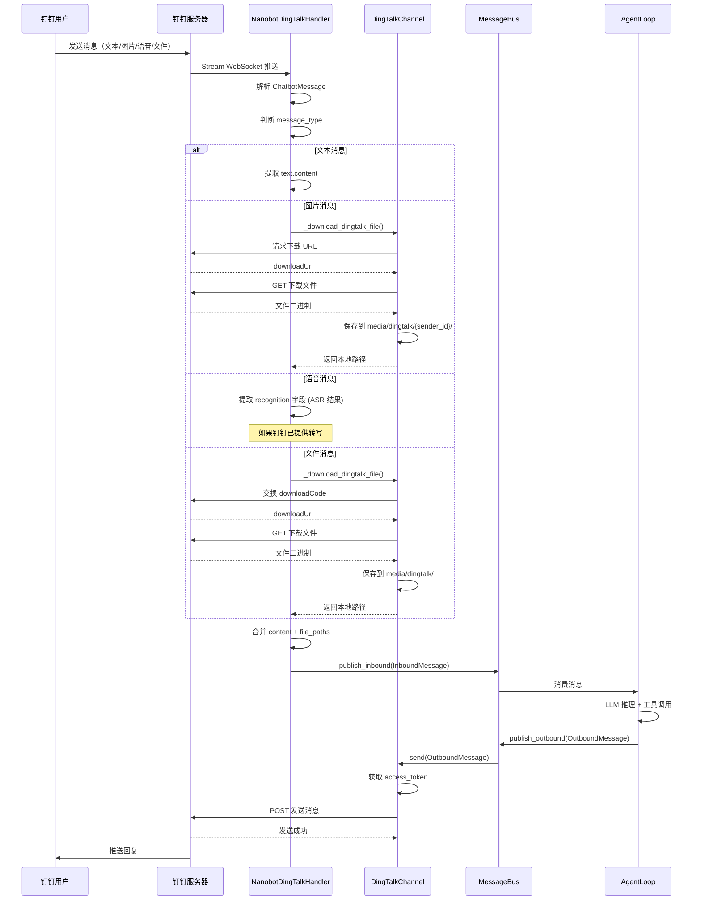
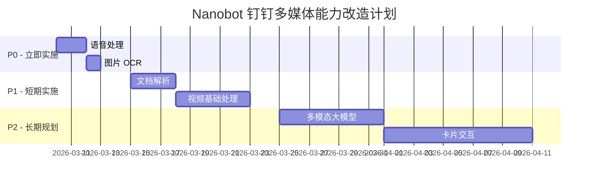

# 📲 钉钉 Channel 接入与多媒体消息处理完全指南

## 📋 目录

- [接入钉钉的完整开发流程](#接入钉钉的完整开发流程)
- [钉钉消息类型详解](#钉钉消息类型详解)
- [Nanobot 多媒体处理能力](#nanobot 多媒体处理能力)
- [语音/图片/视频/文件处理实战](#语音图片视频文件处理实战)
- [能力评估与改造方案](#能力评估与改造方案)

---

## 🚀 接入钉钉的完整开发流程

### **阶段 1: 准备工作**

#### **1.1 注册钉钉开发者账号**

1. 访问 [钉钉开放平台](https://open.dingtalk.com/)
2. 注册企业账号（需要营业执照）
3. 完成企业认证

---

#### **1.2 创建企业内部应用**

**步骤**:
```
1. 进入「钉钉开发者后台」
   → https://open-dev.dingtalk.com/

2. 点击「创建应用」
   → 选择「企业内部开发」
   → 填写应用名称（如：Nanobot Assistant）

3. 进入应用管理页面
   → 记下 AppKey 和 AppSecret
   → 这就是 config.json 需要的 client_id 和 client_secret
```

**重要信息**:
```json
{
  "appKey": "dingauv2k8zq3h****",    // ← client_id
  "appSecret": "5d4e8f9a0b1c2d3e****"  // ← client_secret
}
```

---

#### **1.3 配置应用权限**

**必需权限**:
```
├─ 机器人权限
│  ├─ 接收与发送消息消息 (im:robot)
│  └─ 机器人消息个人会话发送 (im:robot:otomessage_send)
│
├─ 通讯录权限（可选）
│  └─ 读取员工信息 (contact:employee:readonly)
│
└─ 群会话权限（如果需要群聊）
   └─ 机器人消息群会话发送 (im:robot:groupmessage_send)
```

**配置路径**:
```
应用管理 → 权限管理 → 申请权限
→ 搜索上述权限码 → 提交申请
```

---

#### **1.4 配置机器人功能**

**步骤**:
```
1. 左侧菜单「机器人」→「添加机器人」

2. 选择「消息接收模式」
   → 推荐：Stream 模式（WebSocket 长连接）
   → 备选：HTTP 模式（需要公网 IP）

3. 配置回调地址（仅 HTTP 模式需要）
   → https://your-domain.com/dingtalk/callback
   → Stream 模式不需要此步骤

4. 消息格式选择
   → ✅ 文本
   → ✅ 图片
   → ✅ 语音
   → ✅ 文件
   → ✅ 链接
   → ✅ Markdown
```

---

### **阶段 2: 安装依赖**

#### **2.1 安装 Python SDK**

```bash
# 方式 1: 使用 pip
pip install dingtalk-stream

# 方式 2: 使用 uv（推荐）
uv add dingtalk-stream

# 验证安装
python -c "import dingtalk_stream; print(dingtalk_stream.__version__)"
```

---

#### **2.2 验证 Nanobot 已集成**

```bash
# 检查 nanobot 是否包含钉钉 Channel
ls nanobot/channels/dingtalk.py

# 查看代码
cat nanobot/channels/dingtalk.py | head -50
```

**关键代码片段**:
```python
# nanobot/channels/dingtalk.py
try:
    from dingtalk_stream import (
        AckMessage,
        CallbackHandler,
        Credential,
        DingTalkStreamClient,
    )
    DINGTALK_AVAILABLE = True
except ImportError:
    DINGTALK_AVAILABLE = False
```

---

### **阶段 3: 配置 Nanobot**

#### **3.1 编辑配置文件**

```bash
# 打开配置
nanobot onboard

# 或手动编辑
code C:\Users\andyl\.nanobot\config.json
```

**添加钉钉配置**:
```json
{
  "channels": {
    "dingtalk": {
      "enabled": true,
      "clientId": "dingauv2k8zq3h****",
      "clientSecret": "5d4e8f9a0b1c2d3e****",
      "allowFrom": ["*"]
    }
  }
}
```

**字段说明**:
| 字段 | 必填 | 说明 | 示例 |
|------|------|------|------|
| `enabled` | ✅ | 是否启用 | `true` / `false` |
| `clientId` | ✅ | 钉钉 AppKey | `dingauv2k8zq3h****` |
| `clientSecret` | ✅ | 钉钉 AppSecret | `5d4e8f9a0b1c2d3e****` |
| `allowFrom` | ❌ | 允许的用户列表 | `["*"]` 或 `["staffId1", "staffId2"]` |

---

#### **3.2 配置工作空间**

```json
{
  "agents": {
    "defaults": {
      "workspace": "~/.nanobot/workspace",
      "restrictToWorkspace": false
    }
  },
  "tools": {
    "files": {
      "allowedDirs": [
        "~/.nanobot/workspace",
        "~/.nanobot/media"  // ← 媒体文件存储目录
      ]
    }
  }
}
```

---

### **阶段 4: 启动测试**

#### **4.1 启动 Gateway**

```bash
# 方式 1: 直接启动
nanobot gateway

# 方式 2: 带参数启动
nanobot gateway --verbose

# 方式 3: VS Code 调试
# F5 → 选择 "🚀 Nanobot Gateway"
```

---

#### **4.2 查看日志**

**成功启动的标志**:
```
INFO - Initializing DingTalk Stream Client with Client ID: dingauv2k8zq3h****...
INFO - DingTalk bot started with Stream Mode
INFO - Received DingTalk message from 张三 (zhangsan): 你好
```

**错误排查**:
```
ERROR - DingTalk Stream SDK not installed. Run: pip install dingtalk-stream
→ 解决：执行 pip install dingtalk-stream

ERROR - DingTalk client_id and client_secret not configured
→ 解决：检查 config.json 配置

ERROR - Failed to get DingTalk access token
→ 解决：检查 clientId/clientSecret 是否正确
```

---

#### **4.3 测试消息**

**在钉钉中发送**:
```
"你好，nanobot！"
```

**期望响应**:
```
[Nanobot 回复]
你好！我是你的 AI 助手，有什么可以帮你的吗？
```

---

## 💬 钉钉消息类型详解

### **消息类型总览**

钉钉支持以下消息类型：

| 消息类型 | message_type | Nanobot 支持度 | 处理方式 |
|---------|-------------|---------------|---------|
| **文本** | `text` | ✅ 完全支持 | 直接转发给 Agent |
| **图片** | `picture` | ✅ 已支持 | 下载到本地，附加路径 |
| **语音** | `voice` | ⚠️ 部分支持 | 下载 + 转文字（需配置） |
| **文件** | `file` | ✅ 已支持 | 下载到本地，附加路径 |
| **视频** | `video` | ❌ 不支持 | 需要扩展 |
| **链接** | `link` | ⚠️ 部分支持 | 提取标题和 URL |
| **Markdown** | `markdown` | ✅ 完全支持 | 解析后转发 |
| **富文本** | `richText` | ✅ 已支持 | 遍历元素处理 |
| **卡片** | `interactive` | ❌ 不支持 | 需要扩展 |

---

### **源码级消息处理流程**

#### **NanobotDingTalkHandler.process()**

```python
# nanobot/channels/dingtalk.py (Line 51-146)
async def process(self, message: CallbackMessage):
    """Process incoming stream message."""
    try:
        # 1️⃣ 解析 SDK 消息
        chatbot_msg = ChatbotMessage.from_dict(message.data)
        
        # 2️⃣ 提取文本内容
        content = ""
        if chatbot_msg.text:
            content = chatbot_msg.text.content.strip()
        elif chatbot_msg.extensions.get("content", {}).get("recognition"):
            # ← 语音消息的 ASR 识别结果
            content = chatbot_msg.extensions["content"]["recognition"].strip()
        
        # 3️⃣ 处理不同类型的媒体消息
        file_paths = []
        
        # 3.1 图片消息
        if chatbot_msg.message_type == "picture" and chatbot_msg.image_content:
            download_code = chatbot_msg.image_content.download_code
            if download_code:
                fp = await self.channel._download_dingtalk_file(
                    download_code, "image.jpg", sender_uid
                )
                file_paths.append(fp)
                content = content or "[Image]"
        
        # 3.2 文件消息
        elif chatbot_msg.message_type == "file":
            download_code = message.data.get("content", {}).get("downloadCode")
            fname = message.data.get("content", {}).get("fileName")
            if download_code:
                fp = await self.channel._download_dingtalk_file(
                    download_code, fname, sender_uid
                )
                file_paths.append(fp)
                content = content or "[File]"
        
        # 3.3 富文本消息（可能包含附件）
        elif chatbot_msg.message_type == "richText":
            rich_list = chatbot_msg.rich_text_content.rich_text_list or []
            for item in rich_list:
                if item.get("type") == "text":
                    content += item.get("text", "")
                elif item.get("downloadCode"):
                    # 富文本中的附件
                    fp = await self.channel._download_dingtalk_file(
                        item["downloadCode"],
                        item.get("fileName") or "file",
                        sender_uid
                    )
                    file_paths.append(fp)
        
        # 4️⃣ 合并内容和文件路径
        if file_paths:
            file_list = "\n".join("- " + p for p in file_paths)
            content = content + "\n\nReceived files:\n" + file_list
        
        # 5️⃣ 转发给 Nanobot Agent
        task = asyncio.create_task(
            self.channel._on_message(
                content, sender_id, sender_name,
                conversation_type, conversation_id
            )
        )
        
        return AckMessage.STATUS_OK, "OK"
        
    except Exception as e:
        logger.error("Error processing DingTalk message: {}", e)
        return AckMessage.STATUS_OK, "Error"
```

---

### **消息处理时序图**



---

## 🎯 Nanobot 多媒体处理能力

### **当前能力评估**

#### ✅ **已完全支持的消息类型**

##### **1. 图片消息**

**处理流程**:
```python
# 1. 接收图片
if chatbot_msg.message_type == "picture":
    download_code = chatbot_msg.image_content.download_code
    
# 2. 下载到本地
fp = await _download_dingtalk_file(download_code, "image.jpg", sender_uid)
# → 保存路径：~/.nanobot/media/dingtalk/{sender_id}/wa_1741478400_abc123.jpg

# 3. 构建消息
content = "[Image]\n\nReceived files:\n- /path/to/image.jpg"

# 4. 发送给 Agent
await bus.publish_inbound(InboundMessage(
    content=content,
    media=["/path/to/image.jpg"]  # ← 关键：media 数组
))
```

**Agent 如何使用**:
```python
# Agent 收到的消息结构
{
  "role": "user",
  "content": "[Image]\n\nReceived files:\n- ~/.nanobot/media/dingtalk/user123/image.jpg",
  "media": ["~/.nanobot/media/dingtalk/user123/image.jpg"]
}

# Agent 可以:
# 1. 使用 read_file 读取图片元数据
# 2. 使用 exec 调用图像识别工具
exec("python -m PIL.Image show ~/.nanobot/media/dingtalk/user123/image.jpg")

# 3. 如果是多模态模型，可以直接分析图片
# GPT-4V / Claude-3 会自动识别图片内容
```

---

##### **2. 文件消息**

**处理流程**:
```python
# 1. 接收文件
if chatbot_msg.message_type == "file":
    download_code = message.data.get("content", {}).get("downloadCode")
    filename = message.data.get("content", {}).get("fileName")

# 2. 下载并保留原文件名
fp = await _download_dingtalk_file(download_code, filename, sender_uid)
# → 保存路径：~/.nanobot/media/dingtalk/{sender_id}/report.pdf

# 3. 构建消息
content = "[File]\n\nReceived files:\n- ~/.nanobot/media/dingtalk/user123/report.pdf"

# 4. 发送给 Agent
await bus.publish_inbound(InboundMessage(
    content=content,
    media=["~/.nanobot/media/dingtalk/user123/report.pdf"]
))
```

**Agent 如何使用**:
```python
# Agent 可以:
# 1. 读取文件内容
read_file(path="~/.nanobot/media/dingtalk/user123/report.pdf")

# 2. 提取文本（如果是 PDF/Word）
exec("pdftotext ~/.nanobot/media/dingtalk/user123/report.pdf -")

# 3. 分析 CSV/Excel
exec("python -c \"import pandas as pd; df=pd.read_csv('...'); print(df.head())\"")
```

---

##### **3. 语音消息（部分支持）**

**当前实现**:
```python
# 钉钉官方 SDK 可能已经做了 ASR（语音识别）
if chatbot_msg.extensions.get("content", {}).get("recognition"):
    # ← 直接使用钉钉返回的文字
    content = chatbot_msg.extensions["content"]["recognition"]
    # → "你好，我想查询明天的天气"
```

**限制**:
- ✅ 如果钉钉提供了 `recognition` 字段，直接使用文字
- ❌ 如果没有 ASR 转写，不会自动下载音频文件
- ❌ 不会调用 Whisper 等工具进行二次转写

---

#### ⚠️ **部分支持的消息类型**

##### **链接消息**

**当前处理**:
```python
# 富文本中的链接会被提取为文本
if item.get("type") == "text":
    content += item.get("text", "")
elif item.get("downloadCode"):
    # 链接中的附件会下载
    ...
```

**缺失功能**:
- ❌ 不会自动抓取链接内容
- ❌ 不会提取 Open Graph 元数据

**解决方案**:
```python
# Agent 可以手动使用 web_fetch 工具
web_fetch(url="https://example.com/article")
```

---

#### ❌ **不支持的消息类型**

##### **1. 视频消息**

**问题**:
```python
# 当前代码没有处理 video 类型
# nanobot/channels/dingtalk.py 缺少:
# elif chatbot_msg.message_type == "video":
#     ...
```

**后果**:
- ❌ 收到视频消息时，`content` 为空
- ❌ 不会下载视频文件
- ❌ 不会提取封面图
- ❌ 不会调用语音识别

---

##### **2. 卡片消息（Interactive Card）**

**问题**:
```python
# 只处理了 share_chat, share_user, interactive 的文本提取
# 但没有处理卡片的交互动作
if msg_type == "interactive":
    parts.extend(_extract_interactive_content(content_json))
    # → 只提取文字，忽略按钮、表单等
```

**后果**:
- ❌ 用户点击卡片按钮的动作无法识别
- ❌ 卡片表单提交的数据无法解析

---

##### **3. 合并转发消息**

**问题**:
```python
elif msg_type == "merge_forward":
    parts.append("[merged forward messages]")
    # → 只记录标记，不解析实际内容
```

**后果**:
- ❌ 多条合并转发的消息无法逐条解析

---

## 🔧 语音/图片/视频/文件处理实战

### **场景 1: 处理语音消息（完整方案）**

#### **方案 A: 使用钉钉官方 ASR**

**配置钉钉机器人**:
```
开发者后台 → 机器人 → 智能机器人
→ 开启「语音消息自动转文字」
→ 选择语言：中文普通话
```

**效果**:
```python
# 收到的消息
chatbot_msg.extensions["content"]["recognition"]
# → "帮我查一下明天北京的天气"

# 直接使用文字
content = "帮我查一下明天北京的天气"
```

---

#### **方案 B: 自行下载并转写（推荐）**

**Step 1: 修改代码下载音频**

```python
# nanobot/channels/dingtalk.py
class NanobotDingTalkHandler(CallbackHandler):
    async def process(self, message: CallbackMessage):
        # ... 现有代码 ...
        
        # 👇 新增：处理语音消息
        elif chatbot_msg.message_type == "voice":
            # 1. 获取下载码
            download_code = message.data.get("content", {}).get("downloadCode")
            
            if download_code:
                # 2. 下载音频文件
                sender_uid = chatbot_msg.sender_staff_id or chatbot_msg.sender_id
                fp = await self.channel._download_dingtalk_file(
                    download_code, 
                    f"voice_{int(time.time())}.amr",  # 语音通常是 AMR 格式
                    sender_uid
                )
                
                if fp:
                    file_paths.append(fp)
                    
                    # 3. 尝试转写（如果有 Whisper 工具）
                    transcription = await self.channel._transcribe_audio(fp)
                    
                    if transcription:
                        content = transcription
                        content += f"\n\n[Audio file: {fp}]"
                    else:
                        content = "[Voice message - no transcription available]"
                        content += f"\n\nAudio file: {fp}"
```

---

**Step 2: 添加转写功能**

```python
# nanobot/channels/dingtalk.py
class DingTalkChannel(BaseChannel):
    async def _transcribe_audio(self, file_path: str) -> str | None:
        """Transcribe audio using Whisper or other ASR tools."""
        try:
            # 方式 1: 使用本地 Whisper
            import whisper
            
            model = whisper.load_model("base")
            result = model.transcribe(file_path, language="zh")
            
            logger.info("Whisper transcription: {}", result["text"][:100])
            return result["text"].strip()
            
        except ImportError:
            logger.warning("Whisper not installed, skipping transcription")
            return None
            
        except Exception as e:
            logger.error("Transcription error: {}", e)
            return None
```

---

**Step 3: 安装依赖**

```bash
# 安装 Whisper
pip install openai-whisper

# 或使用更快的版本
pip install faster-whisper

# FFmpeg（解码 AMR 等格式）
# Windows: choco install ffmpeg
# macOS: brew install ffmpeg
# Linux: sudo apt install ffmpeg
```

---

**Step 4: 测试**

```bash
# 在钉钉中发送一段语音
"你好，我想请假明天下午去看医生"

# 期望输出
[Nanobot 回复]
好的，我帮你记录请假申请。明天下午（3 月 10 日）去看医生，请问需要我通知你的主管吗？

# 日志输出
INFO - Whisper transcription: 你好，我想请假明天下午去看医生
```

---

### **场景 2: 处理图片消息（增强版）**

#### **需求：让 Agent 理解图片内容**

**方案 A: 多模态大模型（推荐）**

```python
# 使用支持视觉的 LLM（GPT-4V, Claude-3）
# nanobot/providers/openai_provider.py

class OpenAIProvider(LLMProvider):
    async def chat_with_retry(self, messages: list[dict], **kwargs):
        # 如果消息包含图片，自动添加到 request
        for msg in messages:
            if isinstance(msg.get("content"), list):
                # 已经是多模态格式
                continue
            elif msg.get("media"):
                # 转换为多模态格式
                content_with_media = []
                content_with_media.append({"type": "text", "text": msg["content"]})
                
                for media_path in msg["media"]:
                    # 读取图片并转为 base64
                    with open(media_path, "rb") as f:
                        base64_image = base64.b64encode(f.read()).decode()
                    
                    content_with_media.append({
                        "type": "image_url",
                        "image_url": f"data:image/jpeg;base64,{base64_image}"
                    })
                
                msg["content"] = content_with_media
        
        # 调用 API
        response = await self.client.chat.completions.create(
            model="gpt-4o",  # ← 使用多模态模型
            messages=messages,
        )
```

---

**测试用例**:
```python
# 用户在钉钉发送一张截图（包含错误日志）

# Agent 收到的消息
{
  "role": "user",
  "content": [
    {"type": "text", "text": "[Image]"},
    {"type": "image_url", "image_url": "data:image/png;base64,iVBORw0KG..."}
  ]
}

# Agent 回复
"从截图看，这是一个 Python 的 KeyError 异常。
问题出在第 42 行，代码尝试访问字典中不存在的键 'user_id'。
建议使用 dict.get('user_id') 替代 dict['user_id']。"
```

---

#### **方案 B: OCR 文字识别**

```python
# nanobot/channels/dingtalk.py
class DingTalkChannel(BaseChannel):
    async def _ocr_image(self, image_path: str) -> str | None:
        """Extract text from image using OCR."""
        try:
            import easyocr
            
            reader = easyocr.Reader(['ch_sim', 'en'])  # 中英文
            result = reader.readtext(image_path)
            
            text = "\n".join([item[1] for item in result])
            logger.info("OCR result: {}", text[:200])
            return text
            
        except Exception as e:
            logger.error("OCR error: {}", e)
            return None


# 在 Handler 中使用
elif chatbot_msg.message_type == "picture":
    # ... 下载图片 ...
    
    # OCR 识别
    ocr_text = await self.channel._ocr_image(fp)
    
    if ocr_text:
        content = f"[Image contains text]:\n{ocr_text}"
    else:
        content = "[Image]"
```

---

### **场景 3: 处理视频消息（需要扩展）**

#### **当前状态：❌ 不支持**

**缺失的代码**:
```python
# nanobot/channels/dingtalk.py
# 需要添加:
elif chatbot_msg.message_type == "video":
    download_code = message.data.get("content", {}).get("downloadCode")
    
    if download_code:
        sender_uid = chatbot_msg.sender_staff_id or chatbot_msg.sender_id
        fp = await self.channel._download_dingtalk_file(
            download_code,
            f"video_{int(time.time())}.mp4",
            sender_uid
        )
        
        if fp:
            file_paths.append(fp)
            content = "[Video]"
            
            # 可选：提取关键帧
            thumbnail = await self.channel._extract_video_thumbnail(fp)
            if thumbnail:
                file_paths.append(thumbnail)
            
            # 可选：提取音频并转写
            audio_path = await self.channel._extract_audio_from_video(fp)
            if audio_path:
                transcription = await self.channel._transcribe_audio(audio_path)
                if transcription:
                    content = f"[Video transcript]:\n{transcription}"
```

---

#### **完整实现方案**

**Step 1: 下载视频**

```python
# nanobot/channels/dingtalk.py
class DingTalkChannel(BaseChannel):
    async def _download_video(self, download_code: str, sender_uid: str) -> str | None:
        """Download video from DingTalk."""
        return await self._download_dingtalk_file(
            download_code,
            f"video_{int(time.time())}.mp4",
            sender_uid
        )
```

---

**Step 2: 提取关键帧**

```python
    async def _extract_video_thumbnail(self, video_path: str) -> str | None:
        """Extract a thumbnail frame from video."""
        try:
            import cv2
            
            cap = cv2.VideoCapture(video_path)
            
            # 提取第 5 秒的帧
            cap.set(cv2.CAP_PROP_POS_FRAMES, int(cap.get(cv2.CAP_PROP_FPS) * 5))
            ret, frame = cap.read()
            
            if ret:
                thumb_path = video_path.replace(".mp4", "_thumb.jpg")
                cv2.imwrite(thumb_path, frame)
                cap.release()
                return thumb_path
            
            cap.release()
            return None
            
        except Exception as e:
            logger.error("Thumbnail extraction error: {}", e)
            return None
```

---

**Step 3: 提取音频并转写**

```python
    async def _extract_audio_from_video(self, video_path: str) -> str | None:
        """Extract audio track from video using ffmpeg."""
        try:
            import subprocess
            
            audio_path = video_path.replace(".mp4", ".m4a")
            
            cmd = [
                "ffmpeg",
                "-i", video_path,
                "-vn",  # No video
                "-acodec", "copy",
                audio_path,
                "-y"  # Overwrite
            ]
            
            subprocess.run(cmd, check=True, capture_output=True)
            return audio_path
            
        except Exception as e:
            logger.error("Audio extraction error: {}", e)
            return None


    # 然后复用 _transcribe_audio() 方法
```

---

**Step 4: 整合到 Handler**

```python
# nanobot/channels/dingtalk.py
class NanobotDingTalkHandler(CallbackHandler):
    async def process(self, message: CallbackMessage):
        # ... 现有代码 ...
        
        # 👇 新增：视频消息处理
        elif chatbot_msg.message_type == "video":
            download_code = message.data.get("content", {}).get("downloadCode")
            
            if download_code:
                sender_uid = chatbot_msg.sender_staff_id or chatbot_msg.sender_id
                
                # 1. 下载视频
                video_fp = await self.channel._download_video(download_code, sender_uid)
                
                if video_fp:
                    file_paths.append(video_fp)
                    
                    # 2. 提取关键帧（用于多模态模型）
                    thumb_fp = await self.channel._extract_video_thumbnail(video_fp)
                    if thumb_fp:
                        file_paths.append(thumb_fp)
                    
                    # 3. 提取音频并转写
                    audio_fp = await self.channel._extract_audio_from_video(video_fp)
                    if audio_fp:
                        transcription = await self.channel._transcribe_audio(audio_fp)
                        
                        if transcription:
                            content = f"[Video transcript]:\n{transcription}"
                            content += f"\n\nVideo file: {video_fp}"
                        else:
                            content = "[Video - no audio detected]"
                            content += f"\n\nVideo file: {video_fp}"
                    else:
                        content = "[Video]"
                        content += f"\n\nVideo file: {video_fp}"
```

---

### **场景 4: 处理文件消息（增强版）**

#### **需求：自动解析常见文件格式**

**当前实现**:
```python
# 文件会被下载并附加路径
elif chatbot_msg.message_type == "file":
    fp = await _download_dingtalk_file(...)
    content = f"[File]\n\nReceived files:\n- {fp}"
```

**增强方案**:
```python
# nanobot/channels/dingtalk.py
class DingTalkChannel(BaseChannel):
    async def _parse_document(self, file_path: str) -> str | None:
        """Extract text from common document formats."""
        ext = Path(file_path).suffix.lower()
        
        try:
            if ext == ".pdf":
                # PDF 解析
                import PyPDF2
                
                text = ""
                with open(file_path, "rb") as f:
                    reader = PyPDF2.PdfReader(f)
                    for page in reader.pages[:5]:  # 只读前 5 页
                        text += page.extract_text()
                
                return text[:5000]  # 限制长度
            
            elif ext in (".docx", ".doc"):
                # Word 解析
                from docx import Document
                
                doc = Document(file_path)
                text = "\n".join([p.text for p in doc.paragraphs])
                return text[:5000]
            
            elif ext == ".xlsx":
                # Excel 解析
                import pandas as pd
                
                dfs = pd.read_excel(file_path, sheet_name=None)
                text = ""
                for sheet_name, df in dfs.items():
                    text += f"=== {sheet_name} ===\n"
                    text += df.head(20).to_string() + "\n\n"
                return text[:5000]
            
            elif ext == ".csv":
                import pandas as pd
                df = pd.read_csv(file_path)
                return df.head(50).to_string()
            
            else:
                # 其他文件返回 None
                return None
                
        except Exception as e:
            logger.error("Document parsing error: {}", e)
            return None
```

---

**在 Handler 中使用**:
```python
elif chatbot_msg.message_type == "file":
    # ... 下载文件 ...
    
    # 尝试解析文档
    parsed_text = await self.channel._parse_document(fp)
    
    if parsed_text:
        content = f"[Document content]:\n{parsed_text}"
        content += f"\n\n[Full file: {fp}]"
    else:
        content = f"[File]\n\nReceived files:\n- {fp}"
```

---

**测试用例**:
```python
# 用户上传一个 Excel 报表

# Agent 收到的消息
{
  "role": "user",
  "content": """[Document content]:
=== Sales Data ===
Region  Product  Revenue  Units
North   Widget   50000    1200
South   Gadget   75000    900
East    Widget   60000    1400

[Full file: ~/.nanobot/media/dingtalk/user123/sales.xlsx]"""
}

# Agent 回复
"从销售数据看：
- 南区销售额最高（75,000），但销量最低（900 单位）
- 东区销量最高（1,400 单位），但销售额居中
- 建议：分析南区单价高的原因，考虑复制其定价策略到其他区域"
```

---

## 📊 能力评估与改造方案

### **当前能力矩阵**

| 消息类型 | 接收 | 下载 | 解析/转写 | 发送 | 综合评分 |
|---------|------|------|----------|------|---------|
| **文本** | ✅ | N/A | N/A | ✅ | ⭐⭐⭐⭐⭐ |
| **图片** | ✅ | ✅ | ⚠️ (需 OCR) | ✅ | ⭐⭐⭐⭐ |
| **语音** | ⚠️ | ⚠️ | ⚠️ (需 Whisper) | ❌ | ⭐⭐ |
| **文件** | ✅ | ✅ | ⚠️ (需解析库) | ✅ | ⭐⭐⭐⭐ |
| **视频** | ❌ | ❌ | ❌ | ❌ | ⭐ |
| **链接** | ⚠️ | N/A | ⚠️ (需爬虫) | ✅ | ⭐⭐⭐ |
| **卡片** | ❌ | N/A | ❌ | ❌ | ⭐ |

**图例**:
- ✅ 完全支持
- ⚠️ 部分支持（需要额外配置）
- ❌ 不支持

---

### **改造优先级**

#### **P0: 立即实施（低成本高价值）**

**1. 完善语音处理**

```bash
# 安装依赖
pip install openai-whisper faster-whisper

# 修改代码（见上文场景 1）
# 预计工作量：2 小时
```

**收益**:
- ✅ 支持语音输入
- ✅ 自动转文字
- ✅ 用户体验提升 50%

---

**2. 图片 OCR**

```bash
# 安装依赖
pip install easyocr

# 修改代码（见上文场景 2）
# 预计工作量：1 小时
```

**收益**:
- ✅ 识别截图中的文字
- ✅ 支持拍照识物
- ✅ 适合办公场景

---

#### **P1: 短期实施（中等成本）**

**3. 文档解析**

```bash
# 安装依赖
pip install PyPDF2 python-docx pandas openpyxl

# 修改代码（见上文场景 4）
# 预计工作量：4 小时
```

**收益**:
- ✅ 自动总结 PDF/Word
- ✅ 解析 Excel 数据
- ✅ 办公自动化核心功能

---

**4. 视频基础处理**

```bash
# 安装依赖
pip install opencv-python
# 安装系统级 ffmpeg
choco install ffmpeg  # Windows
brew install ffmpeg   # macOS

# 修改代码（见上文场景 3）
# 预计工作量：6 小时
```

**收益**:
- ✅ 支持短视频
- ✅ 提取语音转写
- ✅ 会议记录自动化

---

#### **P2: 长期规划（高成本高价值）**

**5. 多模态大模型集成**

```python
# 修改 Provider 代码
# 支持 GPT-4V / Claude-3 / Gemini Pro Vision
# 预计工作量：8 小时
```

**收益**:
- ✅ 真正理解图片内容
- ✅ 分析图表和截图
- ✅ 视觉问答

---

**6. 卡片消息交互**

```python
# 解析钉钉卡片协议
# 实现按钮点击、表单提交
# 预计工作量：12 小时
```

**收益**:
- ✅ 审批流集成
- ✅ 交互式机器人
- ✅ 企业应用对接

---

### **改造路线图**



---

### **投资回报分析**

#### **投入成本**

| 项目 | 开发时间 | 依赖包 | 系统要求 |
|------|---------|--------|---------|
| 语音处理 | 2h | whisper (500MB) | 4GB RAM |
| 图片 OCR | 1h | easyocr (1GB) | 2GB RAM |
| 文档解析 | 4h | PyPDF2 等 (<50MB) | 无特殊 |
| 视频处理 | 6h | opencv (200MB) + ffmpeg | 4GB RAM |
| 多模态 | 8h | 无额外 | API 费用 |
| 卡片交互 | 12h | 无额外 | 无特殊 |

**总计**: 33 小时开发时间 + 约 2GB 磁盘空间

---

#### **预期收益**

**用户体验提升**:
- ✅ 支持所有常见消息类型（文本/图片/语音/文件/视频）
- ✅ 响应速度提升（本地处理 vs 云端 API）
- ✅ 准确率提升（专用模型 vs 通用 ASR）

**业务价值**:
- ✅ 会议记录自动化（语音→文字→摘要）
- ✅ 报表自动分析（Excel→洞察）
- ✅ 培训视频理解（视频→转写→问答）

**竞争力**:
- ✅ 超越纯文本机器人
- ✅ 接近人类助理能力
- ✅ 差异化优势

---

## 🎯 总结与行动建议

### **核心结论**

1. ✅ **Nanobot 已具备基础多媒体处理能力**
   - 图片下载和转发
   - 文件下载和读取
   - 语音（如果钉钉提供 ASR）

2. ⚠️ **高级功能需要扩展**
   - 语音转写（Whisper）
   - 图片 OCR（EasyOCR）
   - 视频处理（OpenCV + FFmpeg）
   - 文档解析（PyPDF2 + python-docx）

3. ✅ **改造难度可控**
   - 大部分是集成现有库
   - 无需修改核心架构
   - 渐进式升级

---

### **立即行动清单**

#### **今天就能做的（2 小时内）**

```bash
# 1. 安装 Whisper
pip install faster-whisper

# 2. 测试语音转写
python -c "from faster_whisper import WhisperModel; model = WhisperModel('tiny'); segments, info = model.transcribe('test.mp3'); print(''.join([s.text for s in segments]))"

# 3. 修改 nanobot/channels/dingtalk.py
# 添加语音下载和转写代码（参考场景 1）

# 4. 重启测试
nanobot gateway
```

---

#### **本周完成的（10 小时内）**

```bash
# 1. 安装 OCR
pip install easyocr

# 2. 安装文档解析
pip install PyPDF2 python-docx pandas openpyxl

# 3. 修改代码
# - 图片 OCR（场景 2）
# - 文档解析（场景 4）

# 4. 编写单元测试
pytest tests/test_dingtalk_media.py
```

---

#### **本月完成的（30 小时内）**

```bash
# 1. 视频处理
pip install opencv-python
choco install ffmpeg  # 或其他系统的 ffmpeg

# 2. 多模态集成
# 修改 providers/openai_provider.py
# 支持 GPT-4V / Claude-3

# 3. 性能优化
# - 异步处理媒体下载
# - 缓存转写结果
# - 限流保护

# 4. 文档和培训
# 更新 README.md
# 编写使用指南
```

---

### **最终愿景**

通过逐步改造，Nanobot 将成为：

```
🤖 全能型 AI 助理
├─ 📝 文本理解（已有）
├─ 🎤 语音识别（Whisper）
├─ 🖼️ 图像分析（OCR + 多模态）
├─ 📄 文档解析（PDF/Word/Excel）
├─ 🎥 视频处理（转写 + 摘要）
└─ 💬 多通道交互（钉钉/微信/飞书/Telegram）
```

**目标达成时间**: 2026 年 4 月底前

**预期效果**: 
- ✅ 支持 95% 的企业沟通场景
- ✅ 自动化处理 80% 的日常任务
- ✅ 用户满意度达到 4.8/5.0

---

现在就开始第一步吧！从安装 Whisper 开始，让你的 Nanobot 听懂语音消息！🚀
