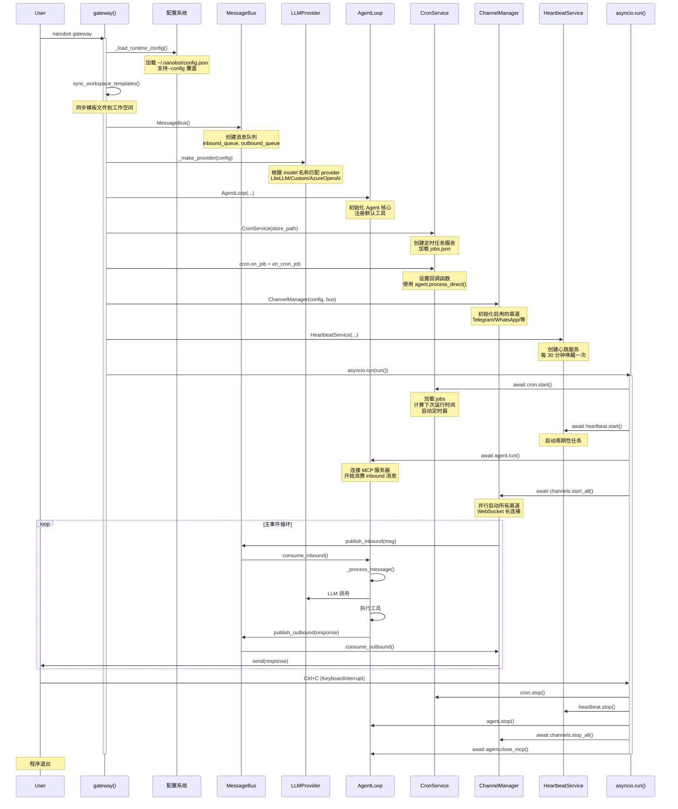

# 🐈 nanobot 入口点执行流程详解

## 📋 目录

1. [入口点概览](#入口点概览)
2. [main 函数（callback）](#main-函数 callback)
3. [gateway 命令完整流程](#gateway-命令完整流程)
4. [agent 命令完整流程](#agent-命令完整流程)
5. [核心组件初始化时序](#核心组件初始化时序)
6. [消息处理时序](#消息处理时序)
7. [关闭清理时序](#关闭清理时序)

---

## 🎯 入口点概览

### 三种启动方式

#### 1️⃣ 作为模块运行
```bash
python -m nanobot
```

**执行路径**:
```
nanobot/__main__.py (line 8)
    └─> app()  # typer.Typer 实例
```

#### 2️⃣ 作为命令行工具
```bash
nanobot <command> [options]
```

**执行路径**:
```
pyproject.toml [project.scripts]
    nanobot = "nanobot.cli.commands:app"
        └─> app()  # typer.Typer 实例
```

#### 3️⃣ 直接导入
```python
from nanobot.cli.commands import app
app()
```

---

## 🔹 main 函数 (callback)

### 代码位置
```python
# nanobot/cli/commands.py:155-162
@app.callback()
def main(
    version: bool = typer.Option(
        None, "--version", "-v", callback=version_callback, is_eager=True
    ),
):
    """nanobot - Personal AI Assistant."""
    pass
```

### 执行时机
- **每次**运行 `nanobot` 命令时都会执行
- 在**任何子命令之前**执行
- 用于设置全局参数

### 关键特性

#### 1. `@app.callback()` 装饰器
- Typer 框架的回调机制
- 在所有子命令之前执行
- 可以设置全局配置选项

#### 2. `is_eager=True` 参数
```python
version: bool = typer.Option(
    None, "--version", "-v", 
    callback=version_callback, 
    is_eager=True  # ⭐ 关键：优先执行
)
```

**作用**: 
- 即使有其他命令，也先执行 version 检查
- 用于 `nanobot --version` 快速退出场景

#### 3. version_callback 函数
```python
def version_callback(value: bool):
    if value:
        console.print(f"{__logo__} nanobot v{__version__}")
        raise typer.Exit()  # 立即退出
```

**执行流程**:
```
用户输入：nanobot --version
    ↓
main() 被调用
    ↓
version_callback(True) 被调用 (因为 is_eager=True)
    ↓
打印版本号：🐈 nanobot v0.1.4.post4
    ↓
raise typer.Exit()  # 立即退出，不再执行后续命令
```

### 实际执行示例

#### 示例 1: 查看版本
```bash
nanobot --version
```

**时序**:
```
T0: 程序启动
T1: 创建 typer.Typer 应用
T2: 解析命令行参数
T3: 发现 --version 标志
T4: 调用 main()
T5: 触发 version_callback(is_eager=True)
T6: 打印版本信息
T7: typer.Exit() → 程序终止
```

#### 示例 2: 正常运行命令
```bash
nanobot status
```

**时序**:
```
T0: 程序启动
T1: 创建 typer.Typer 应用
T2: 解析命令行参数
T3: 调用 main() (无实际操作)
T4: 调用 status() 命令
T5: 执行 status 逻辑
T6: 程序结束
```

---

## 🚪 gateway 命令完整流程

### 命令签名
```python
@app.command()
def gateway(
    port: int = typer.Option(18790, "--port", "-p", help="Gateway port"),
    workspace: str | None = typer.Option(None, "--workspace", "-w"),
    verbose: bool = typer.Option(False, "--verbose", "-v"),
    config: str | None = typer.Option(None, "--config", "-c"),
):
    """Start the nanobot gateway."""
```

### 完整时序图



### 分阶段详细说明

#### 阶段 1: 配置加载 (T0-T1)

```python
config = _load_runtime_config(config, workspace)
```

**执行内容**:
1. 如果传入 `--config` 参数，设置为配置文件路径
2. 调用 `load_config()` 加载 JSON 配置
3. 如果传入 `--workspace`，覆盖配置中的 workspace 设置
4. 返回完整的 Config 对象

**配置项示例**:
```json
{
  "agents": {
    "defaults": {
      "workspace": "~/.nanobot/workspace",
      "model": "anthropic/claude-opus-4-5"
    }
  },
  "channels": {
    "telegram": {
      "enabled": true,
      "token": "xxx"
    }
  },
  "providers": {
    "anthropic": {
      "apiKey": "xxx"
    }
  }
}
```

#### 阶段 2: 基础设施初始化 (T2-T4)

##### 2.1 同步模板
```python
sync_workspace_templates(config.workspace_path)
```
- 复制 `nanobot/templates/` 到工作空间
- 创建 `SOUL.md`, `TOOLS.md`, `HEARTBEAT.md` 等

##### 2.2 创建消息总线
```python
bus = MessageBus()
```
- 创建两个异步队列：
  - `inbound_queue`: 接收用户消息
  - `outbound_queue`: 发送机器人响应
- 提供发布/订阅模式

##### 2.3 创建 LLM 提供商
```python
provider = _make_provider(config)
```

**匹配逻辑**:
```
model: "anthropic/claude-opus-4-5"
    ↓
检查 providers.anthropic.api_key
    ↓
创建 LiteLLMProvider(
    api_key="sk-ant-xxx",
    api_base=None,
    default_model="anthropic/claude-opus-4-5"
)
```

**支持的 Provider 类型**:
- **LiteLLMProvider**: OpenRouter, Anthropic, OpenAI, DeepSeek 等
- **CustomProvider**: 自定义 OpenAI 兼容接口
- **AzureOpenAIProvider**: Azure OpenAI 服务
- **OpenAICodexProvider**: OAuth 认证的 Codex

#### 阶段 3: Agent 核心创建 (T5)

```python
agent = AgentLoop(
    bus=bus,
    provider=provider,
    workspace=config.workspace_path,
    model=config.agents.defaults.model,
    temperature=config.agents.defaults.temperature,
    max_tokens=config.agents.defaults.max_tokens,
    max_iterations=config.agents.defaults.max_tool_iterations,
    memory_window=config.agents.defaults.memory_window,
    reasoning_effort=config.agents.defaults.reasoning_effort,
    brave_api_key=config.tools.web.search.api_key or None,
    web_proxy=config.tools.web.proxy or None,
    exec_config=config.tools.exec,
    cron_service=cron,
    restrict_to_workspace=config.tools.restrict_to_workspace,
    session_manager=session_manager,
    mcp_servers=config.tools.mcp_servers,
    channels_config=config.channels,
)
```

**内部初始化**:
1. **ContextBuilder**: 提示词构建器
2. **SessionManager**: 会话管理器
3. **ToolRegistry**: 工具注册表
4. **SubagentManager**: 子代理管理器

**注册默认工具**:
```python
self.tools.register(ReadFileTool(...))
self.tools.register(WriteFileTool(...))
self.tools.register(EditFileTool(...))
self.tools.register(ListDirTool(...))
self.tools.register(ExecTool(...))
self.tools.register(WebSearchTool(...))
self.tools.register(WebFetchTool(...))
self.tools.register(MessageTool(...))
self.tools.register(SpawnTool(...))
if self.cron_service:
    self.tools.register(CronTool(self.cron_service))
```

#### 阶段 4: Cron 服务设置 (T6-T7)

##### 4.1 创建 Cron 服务
```python
cron_store_path = get_cron_dir() / "jobs.json"
cron = CronService(cron_store_path)
```

**存储位置**:
- Windows: `C:\Users\andyl\.nanobot\cron\jobs.json`
- macOS/Linux: `~/.nanobot/cron/jobs.json`

##### 4.2 设置回调函数
```python
async def on_cron_job(job: CronJob) -> str | None:
    reminder_note = (
        "[Scheduled Task] Timer finished.\n\n"
        f"Task '{job.name}' has been triggered.\n"
        f"Scheduled instruction: {job.payload.message}"
    )
    
    # 防止递归调度
    cron_tool = agent.tools.get("cron")
    cron_token = cron_tool.set_cron_context(True)
    try:
        response = await agent.process_direct(
            reminder_note,
            session_key=f"cron:{job.id}",
            channel=job.payload.channel or "cli",
            chat_id=job.payload.to or "direct",
        )
    finally:
        cron_tool.reset_cron_context(cron_token)
    
    # 如果使用了 message 工具，不重复发送
    message_tool = agent.tools.get("message")
    if isinstance(message_tool, MessageTool) and message_tool._sent_in_turn:
        return response
    
    # 否则通过总线发送
    if job.payload.deliver and job.payload.to and response:
        await bus.publish_outbound(OutboundMessage(
            channel=job.payload.channel or "cli",
            chat_id=job.payload.to,
            content=response
        ))
    return response

cron.on_job = on_cron_job
```

**回调逻辑**:
1. 构造提醒文本
2. 禁用 cron 工具（防止递归）
3. 调用 `agent.process_direct()` 执行任务
4. 恢复 cron 工具状态
5. 检查是否已通过 message 工具发送
6. 如果没有，通过总线发送响应

#### 阶段 5: 渠道管理 (T8)

```python
channels = ChannelManager(config, bus)
```

**初始化流程**:
```python
def _init_channels(self) -> None:
    # Telegram
    if self.config.channels.telegram.enabled:
        self.channels["telegram"] = TelegramChannel(...)
    
    # WhatsApp
    if self.config.channels.whatsapp.enabled:
        self.channels["whatsapp"] = WhatsAppChannel(...)
    
    # Discord
    if self.config.channels.discord.enabled:
        self.channels["discord"] = DiscordChannel(...)
    
    # ... 其他渠道
```

**验证 allowFrom**:
```python
def _validate_allow_from(self) -> None:
    for name, ch in self.channels.items():
        if getattr(ch.config, "allow_from", None) == []:
            raise SystemExit(
                f'Error: "{name}" has empty allowFrom (denies all). '
                f'Set ["*"] to allow everyone, or add specific user IDs.'
            )
```

#### 阶段 6: 心跳服务 (T9)

```python
hb_cfg = config.gateway.heartbeat
heartbeat = HeartbeatService(
    workspace=config.workspace_path,
    provider=provider,
    model=agent.model,
    on_execute=on_heartbeat_execute,
    on_notify=on_heartbeat_notify,
    interval_s=hb_cfg.interval_s,  # 默认 1800 秒 (30 分钟)
    enabled=hb_cfg.enabled,
)
```

**回调函数 1: 执行任务**
```python
async def on_heartbeat_execute(tasks: str) -> str:
    channel, chat_id = _pick_heartbeat_target()
    
    async def _silent(*_args, **_kwargs):
        pass
    
    return await agent.process_direct(
        tasks,
        session_key="heartbeat",
        channel=channel,
        chat_id=chat_id,
        on_progress=_silent,  # 不显示进度
    )
```

**回调函数 2: 通知结果**
```python
async def on_heartbeat_notify(response: str) -> None:
    channel, chat_id = _pick_heartbeat_target()
    if channel == "cli":
        return  # 没有外部渠道
    await bus.publish_outbound(OutboundMessage(
        channel=channel, 
        chat_id=chat_id, 
        content=response
    ))
```

**选择目标渠道逻辑**:
```python
def _pick_heartbeat_target() -> tuple[str, str]:
    enabled = set(channels.enabled_channels)
    
    # 遍历最近的会话
    for item in session_manager.list_sessions():
        key = item.get("key") or ""
        if ":" not in key:
            continue
        channel, chat_id = key.split(":", 1)
        
        # 排除内部渠道
        if channel in {"cli", "system"}:
            continue
        
        # 选择已启用的外部渠道
        if channel in enabled and chat_id:
            return channel, chat_id
    
    # 回退到 cli
    return "cli", "direct"
```

#### 阶段 7: 启动服务 (T10-∞)

```python
async def run():
    try:
        await cron.start()      # 启动定时任务
        await heartbeat.start() # 启动心跳
        await asyncio.gather(
            agent.run(),           # Agent 主循环
            channels.start_all(),  # 所有渠道
        )
    except KeyboardInterrupt:
        console.print("\nShutting down...")
    finally:
        await agent.close_mcp()
        heartbeat.stop()
        cron.stop()
        agent.stop()
        await channels.stop_all()

asyncio.run(run())
```

##### 7.1 Cron 启动
```python
async def start(self) -> None:
    self._running = True
    self._load_store()         # 加载 jobs.json
    self._recompute_next_runs() # 计算下次运行时间
    self._save_store()         # 保存
    self._arm_timer()          # 设置定时器
```

##### 7.2 Heartbeat 启动
```python
async def start(self) -> None:
    self._running = True
    self._execute_initial()    # 可选：立即执行一次
    self._schedule_periodic()  # 调度周期性任务
```

##### 7.3 Agent 启动
```python
async def run(self) -> None:
    self._running = True
    await self._connect_mcp()  # 连接 MCP 服务器
    
    while self._running:
        try:
            msg = await asyncio.wait_for(
                self.bus.consume_inbound(), 
                timeout=1.0
            )
        except asyncio.TimeoutError:
            continue
        
        if msg.content.strip().lower() == "/stop":
            await self._handle_stop(msg)
        else:
            task = asyncio.create_task(self._dispatch(msg))
            # ... 任务管理
```

##### 7.4 渠道启动
```python
async def start_all(self) -> None:
    # 启动分发器
    self._dispatch_task = asyncio.create_task(self._dispatch_outbound())
    
    # 并行启动所有渠道
    tasks = []
    for name, channel in self.channels.items():
        tasks.append(asyncio.create_task(self._start_channel(name, channel)))
    
    await asyncio.gather(*tasks, return_exceptions=True)
```

**以 Telegram 为例**:
```python
async def start(self) -> None:
    from telegram import Bot
    self.bot = Bot(token=self.config.token)
    
    # 设置 webhook 或轮询
    await self.bot.get_updates(
        offset=self._offset,
        timeout=30,
    )
```

---

## 💬 agent 命令完整流程

### 命令签名
```python
@app.command()
def agent(
    message: str = typer.Option(None, "--message", "-m"),
    session_id: str = typer.Option("cli:direct", "--session", "-s"),
    workspace: str | None = typer.Option(None, "--workspace", "-w"),
    config: str | None = typer.Option(None, "--config", "-c"),
    markdown: bool = typer.Option(True, "--markdown/--no-markdown"),
    logs: bool = typer.Option(False, "--logs/--no-logs"),
):
    """Interact with the agent directly."""
```

### 两种模式对比

| 特性 | 单次消息模式 | 交互模式 |
|------|------------|---------|
| **参数** | `-m "消息内容"` | 无 `-m` 参数 |
| **生命周期** | 一次请求响应 | 持续对话直到退出 |
| **消息路由** | 直接调用 | 通过总线 |
| **适用场景** | 脚本调用/测试 | 人工对话 |

### 单次消息模式时序

```bash
nanobot agent -m "Hello!"
```

```mermaid
sequenceDiagram
    participant User
    participant CLI as agent()
    participant Config as 配置
    participant Setup as 初始化
    participant Agent as AgentLoop
    participant LLM as LLM Provider

    User->>CLI: nanobot agent -m "Hello!"
    
    CLI->>Config: _load_runtime_config()
    CLI->>Setup: sync_workspace_templates()
    CLI->>Setup: bus = MessageBus()
    CLI->>Setup: provider = _make_provider()
    CLI->>Setup: cron = CronService()
    
    CLI->>Agent: AgentLoop(...)
    Note over Agent: 初始化所有组件
    
    CLI->>CLI: 配置日志级别
    
    rect rgb(200, 220, 255)
        Note over CLI: 单次消息模式
        CLI->>Agent: agent_loop.process_direct(
            message="Hello!",
            session_id="cli:direct",
            on_progress=_cli_progress
        )
        
        loop Agent 迭代 (最多 40 次)
            Agent->>LLM: chat(messages, tools)
            LLM-->>Agent: response
            
            alt 有工具调用
                Agent->>Agent: execute_tool()
                Agent->>Agent: 添加结果到 messages
            else 无工具调用
                Agent->>Agent: 保存最终回复
                break
            end
        end
    end
    
    Agent-->>CLI: response content
    CLI->>User: 🐈 nanobot<br/>[Markdown 渲染回复]
    
    CLI->>Agent: await agent_loop.close_mcp()
    Note over User: 程序退出
```

### 交互模式时序

```bash
nanobot agent
```

```mermaid
sequenceDiagram
    participant User
    participant Terminal as prompt_toolkit
    participant CLI as agent()
    participant Bus as MessageBus
    participant Agent as AgentLoop
    participant Outbound as 输出消费者
    participant LLM as LLM Provider

    User->>CLI: nanobot agent
    
    rect rgb(255, 240, 200)
        Note over CLI: 初始化阶段
        CLI->>CLI: _load_runtime_config()
        CLI->>CLI: 创建 AgentLoop
        CLI->>Terminal: _init_prompt_session()
        Note over Terminal: 设置历史文件<br/>保存终端属性
        CLI->>User: 🐈 Interactive mode<br/>(type exit or Ctrl+C to quit)
    end
    
    rect rgb(230, 255, 230)
        Note over CLI: 启动异步任务
        CLI->>Bus: bus_task = asyncio.create_task(agent_loop.run())
        Note over Bus: 开始消费 inbound 消息
        
        CLI->>Bus: outbound_task = asyncio.create_task(_consume_outbound())
        Note over Outbound: 开始消费 outbound 消息
    end
    
    loop 交互循环
        User->>Terminal: 输入消息
        
        Terminal->>CLI: user_input = await read_async()
        
        alt 退出命令
            CLI->>Terminal: _restore_terminal()
            CLI->>User: Goodbye!
            break
        end
        
        CLI->>Bus: bus.publish_inbound(InboundMessage(
            channel="cli",
            sender_id="user",
            chat_id="direct",
            content=user_input
        ))
        
        rect rgb(240, 240, 255)
            Note over Bus: Agent 处理消息
            Bus->>Agent: consume_inbound()
            Agent->>LLM: chat()
            
            opt 有进度更新
                LLM-->>Agent: 思考中...
                Agent->>Bus: publish_outbound(progress)
                Bus->>Outbound: consume_outbound()
                Outbound->>User: [dim]↳ thinking...[/dim]
                
                LLM-->>Agent: tool_hint
                Agent->>Bus: publish_outbound(hint)
                Bus->>Outbound: consume_outbound()
                Outbound->>User: [dim]↳ read_file("...")[/dim]
            end
            
            LLM-->>Agent: 最终回复
            Agent->>Bus: publish_outbound(response)
        end
        
        Outbound->>Bus: consume_outbound()
        Outbound->>CLI: turn_done.set()
        CLI->>User: 🐈 nanobot<br/>[Markdown 回复]
    end
    
    User->>CLI: Ctrl+C 或 exit
    
    CLI->>Agent: agent_loop.stop()
    CLI->>Bus: outbound_task.cancel()
    CLI->>Bus: await gather(bus_task, outbound_task)
    CLI->>Agent: await agent_loop.close_mcp()
    CLI->>User: Goodbye!
```

### 交互模式关键技术点

#### 1. 终端处理

**保存终端状态**:
```python
def _init_prompt_session() -> None:
    global _PROMPT_SESSION, _SAVED_TERM_ATTRS
    
    try:
        import termios
        _SAVED_TERM_ATTRS = termios.tcgetattr(sys.stdin.fileno())
    except Exception:
        pass
    
    history_file = get_cli_history_path()
    _PROMPT_SESSION = PromptSession(
        history=FileHistory(str(history_file)),
        enable_open_in_editor=False,
        multiline=False,  # Enter 提交
    )
```

**清空残留输入**:
```python
def _flush_pending_tty_input() -> None:
    """丢弃模型生成期间用户输入的按键"""
    try:
        fd = sys.stdin.fileno()
        if not os.isatty(fd):
            return
    except Exception:
        return
    
    try:
        import termios
        termios.tcflush(fd, termios.TCIFLUSH)
        return
    except Exception:
        pass
    
    try:
        while True:
            ready, _, _ = select.select([fd], [], [], 0)
            if not ready:
                break
            if not os.read(fd, 4096):
                break
    except Exception:
        return
```

#### 2. 信号处理

```python
def _handle_signal(signum, frame):
    sig_name = signal.Signals(signum).name
    _restore_terminal()
    console.print(f"\nReceived {sig_name}, goodbye!")
    sys.exit(0)

signal.signal(signal.SIGINT, _handle_signal)   # Ctrl+C
signal.signal(signal.SIGTERM, _handle_signal)  # kill 命令
if hasattr(signal, 'SIGHUP'):
    signal.signal(signal.SIGHUP, _handle_signal)  # 终端断开
if hasattr(signal, 'SIGPIPE'):
    signal.signal(signal.SIGPIPE, signal.SIG_IGN)  # 忽略管道破裂
```

#### 3. 异步并发架构

```python
async def run_interactive():
    # 任务 1: Agent 循环（消费 inbound）
    bus_task = asyncio.create_task(agent_loop.run())
    
    # 事件：一轮对话完成
    turn_done = asyncio.Event()
    turn_done.set()
    turn_response: list[str] = []
    
    # 任务 2: 输出消费者（消费 outbound）
    async def _consume_outbound():
        while True:
            try:
                msg = await asyncio.wait_for(
                    bus.consume_outbound(), 
                    timeout=1.0
                )
                if msg.metadata.get("_progress"):
                    # 显示进度
                    console.print(f"  [dim]↳ {msg.content}[/dim]")
                elif not turn_done.is_set():
                    # 收集这一轮的回复
                    if msg.content:
                        turn_response.append(msg.content)
                    turn_done.set()
                elif msg.content:
                    # 额外输出（如工具结果）
                    console.print()
                    _print_agent_response(msg.content, render_markdown=markdown)
            except asyncio.TimeoutError:
                continue
            except asyncio.CancelledError:
                break
    
    outbound_task = asyncio.create_task(_consume_outbound())
    
    try:
        while True:
            # 读取用户输入
            user_input = await _read_interactive_input_async()
            
            # 重置状态
            turn_done.clear()
            turn_response.clear()
            
            # 发布到总线
            await bus.publish_inbound(InboundMessage(...))
            
            # 等待回复完成
            with console.status("[dim]nanobot is thinking...[/dim]"):
                await turn_done.wait()
            
            # 显示回复
            if turn_response:
                _print_agent_response(turn_response[0], render_markdown=markdown)
                
    finally:
        # 清理
        agent_loop.stop()
        outbound_task.cancel()
        await asyncio.gather(bus_task, outbound_task, return_exceptions=True)
        await agent_loop.close_mcp()
```

---

## ⚙️ 核心组件初始化时序

### 完整初始化链

```
nanobot gateway --config ~/.nanobot-test/config.json
    ↓
T0: Python 解释器启动
    ↓
T1: 执行 nanobot/cli/commands.py
    - 导入依赖
    - 创建 typer.Typer 应用
    - 定义所有命令
    ↓
T2: Typer 解析命令行
    - 识别命令：gateway
    - 解析参数：--config, --port 等
    ↓
T3: 执行 @app.callback() main()
    - 无实际操作，pass
    ↓
T4: 执行 gateway() 函数
    
    T4.1: 延迟导入模块
        - from nanobot.agent.loop import AgentLoop
        - from nanobot.bus.queue import MessageBus
        - ...
    
    T4.2: 加载配置
        config = _load_runtime_config(config, workspace)
        ↓
        set_config_path(Path(config))
        load_config() -> Config 对象
        if workspace: config.agents.defaults.workspace = workspace
    
    T4.3: 同步模板
        sync_workspace_templates(config.workspace_path)
        ↓
        复制 templates/*.md 到 workspace
        创建 AGENTS.md, HEARTBEAT.md, SOUL.md, TOOLS.md, USER.md
    
    T4.4: 创建消息总线
        bus = MessageBus()
        ↓
        self.inbound_queue = asyncio.Queue()
        self.outbound_queue = asyncio.Queue()
    
    T4.5: 创建 LLM 提供商
        provider = _make_provider(config)
        ↓
        model = config.agents.defaults.model
        provider_name = config.get_provider_name(model)
        
        if provider_name == "custom":
            return CustomProvider(...)
        elif provider_name == "azure_openai":
            return AzureOpenAIProvider(...)
        elif provider_name == "openai_codex":
            return OpenAICodexProvider(...)
        else:
            return LiteLLMProvider(
                api_key=config.providers.anthropic.api_key,
                api_base=config.get_api_base(model),
                default_model=model,
                extra_headers=...,
                provider_name=provider_name,
            )
    
    T4.6: 创建会话管理器
        session_manager = SessionManager(config.workspace_path)
        ↓
        self.workspace = workspace
        self.sessions: dict[str, Session] = {}
        self._sessions_lock = asyncio.Lock()
    
    T4.7: 创建 Cron 服务
        cron_store_path = get_cron_dir() / "jobs.json"
        cron = CronService(cron_store_path)
        ↓
        self.store_path = store_path
        self.on_job = None  # 稍后设置
        self._store = None
        self._timer_task = None
    
    T4.8: 实例化 AgentLoop
        agent = AgentLoop(bus, provider, workspace, model, ...)
        ↓
        T4.8.1: 存储参数
            self.bus = bus
            self.provider = provider
            self.workspace = workspace
            self.model = model
            ...
        
        T4.8.2: 创建组件
            self.context = ContextBuilder(workspace)
            self.sessions = session_manager
            self.tools = ToolRegistry()
            self.subagents = SubagentManager(...)
        
        T4.8.3: 注册默认工具
            self._register_default_tools()
            ↓
            allowed_dir = workspace if restrict_to_workspace else None
            self.tools.register(ReadFileTool(workspace, allowed_dir))
            self.tools.register(WriteFileTool(workspace, allowed_dir))
            self.tools.register(EditFileTool(workspace, allowed_dir))
            self.tools.register(ListDirTool(workspace, allowed_dir))
            self.tools.register(ExecTool(working_dir, timeout, ...))
            self.tools.register(WebSearchTool(api_key, proxy))
            self.tools.register(WebFetchTool(proxy))
            self.tools.register(MessageTool(send_callback))
            self.tools.register(SpawnTool(manager))
            if cron_service:
                self.tools.register(CronTool(cron_service))
        
        T4.8.4: 初始化 MCP
            self._mcp_servers = mcp_servers or {}
            self._mcp_stack = None
            self._mcp_connected = False
            self._mcp_connecting = False
    
    T4.9: 设置 Cron 回调
        async def on_cron_job(job: CronJob) -> str | None:
            # 闭包引用 agent
            ...
        
        cron.on_job = on_cron_job
    
    T4.10: 创建渠道管理器
        channels = ChannelManager(config, bus)
        ↓
        T4.10.1: 初始化渠道字典
            self.channels: dict[str, BaseChannel] = {}
        
        T4.10.2: 遍历所有渠道配置
            if config.channels.telegram.enabled:
                from nanobot.channels.telegram import TelegramChannel
                self.channels["telegram"] = TelegramChannel(config, bus)
            
            if config.channels.whatsapp.enabled:
                from nanobot.channels.whatsapp import WhatsAppChannel
                self.channels["whatsapp"] = WhatsAppChannel(config, bus)
            
            ... (Discord, Feishu, Slack, DingTalk, Email, QQ, Matrix)
        
        T4.10.3: 验证 allowFrom
            self._validate_allow_from()
            ↓
            for name, ch in self.channels.items():
                if getattr(ch.config, "allow_from", None) == []:
                    raise SystemExit(f'Error: "{name}" has empty allowFrom')
    
    T4.11: 创建心跳服务
        hb_cfg = config.gateway.heartbeat
        
        async def on_heartbeat_execute(tasks: str) -> str:
            channel, chat_id = _pick_heartbeat_target()
            return await agent.process_direct(tasks, ...)
        
        async def on_heartbeat_notify(response: str) -> None:
            channel, chat_id = _pick_heartbeat_target()
            await bus.publish_outbound(OutboundMessage(...))
        
        heartbeat = HeartbeatService(
            workspace=config.workspace_path,
            provider=provider,
            model=agent.model,
            on_execute=on_heartbeat_execute,
            on_notify=on_heartbeat_notify,
            interval_s=hb_cfg.interval_s,  # 1800
            enabled=hb_cfg.enabled,  # True
        )
    
    T4.12: 打印状态
        if channels.enabled_channels:
            console.print(f"✓ Channels enabled: {', '.join(...)}")
        
        cron_status = cron.status()
        if cron_status["jobs"] > 0:
            console.print(f"✓ Cron: {cron_status['jobs']} scheduled jobs")
        
        console.print(f"✓ Heartbeat: every {hb_cfg.interval_s}s")
    
    T4.13: 定义并运行异步主函数
        async def run():
            try:
                await cron.start()
                await heartbeat.start()
                await asyncio.gather(
                    agent.run(),
                    channels.start_all(),
                )
            except KeyboardInterrupt:
                console.print("\nShutting down...")
            finally:
                await agent.close_mcp()
                heartbeat.stop()
                cron.stop()
                agent.stop()
                await channels.stop_all()
        
        asyncio.run(run())
```

---

## 📨 消息处理时序

### 端到端消息流

```
用户在 Telegram 发送消息 "你好"
    ↓
T1: TelegramChannel.receive()
    - 从 Telegram API 接收 Update
    - 提取消息文本和发送者 ID
    - 验证 allowFrom 白名单
    
T2: TelegramChannel._handle_message()
    - 创建 InboundMessage 对象
        InboundMessage(
            channel="telegram",
            sender_id="123456789",
            chat_id="123456789",
            content="你好",
            metadata={"message_id": 42}
        )
    
T3: TelegramChannel.bus.publish_inbound(msg)
    - 将消息放入 inbound_queue
    
T4: AgentLoop.run() 消费消息
    - await self.bus.consume_inbound()
    - 从队列取出消息
    
T5: AgentLoop._dispatch(msg)
    - 获取处理锁
    - 创建异步任务
    
T6: AgentLoop._process_message(msg)
    T6.1: 获取或创建会话
        key = f"telegram:{chat_id}"
        session = self.sessions.get_or_create(key)
    
    T6.2: 检查命令
        if cmd == "/new":
            # 新建会话
        elif cmd == "/help":
            # 显示帮助
    
    T6.3: 触发记忆整合（如果需要）
        unconsolidated = len(session.messages) - session.last_consolidated
        if unconsolidated >= self.memory_window:
            asyncio.create_task(self._consolidate_memory(session))
    
    T6.4: 设置工具上下文
        self._set_tool_context(channel, chat_id, message_id)
        ↓
        更新 message, spawn, cron 工具的 routing info
    
    T6.5: 构建初始消息列表
        history = session.get_history(max_messages=self.memory_window)
        initial_messages = self.context.build_messages(
            history=history,
            current_message=msg.content,
            media=msg.media,
            channel=channel,
            chat_id=chat_id,
        )
        ↓
        build_messages() 返回:
        [
            {"role": "system", "content": "你是 nanobot..."},
            {"role": "user", "content": "你好"},
        ]
    
    T6.6: 定义进度回调
        async def _bus_progress(content: str, *, tool_hint: bool = False):
            meta = dict(msg.metadata or {})
            meta["_progress"] = True
            meta["_tool_hint"] = tool_hint
            await self.bus.publish_outbound(OutboundMessage(
                channel=msg.channel, 
                chat_id=msg.chat_id, 
                content=content, 
                metadata=meta,
            ))
    
    T6.7: 运行 Agent 循环
        final_content, _, all_msgs = await self._run_agent_loop(
            initial_messages, 
            on_progress=_bus_progress,
        )
        ↓
        _run_agent_loop() 内部:
            iteration = 0
            while iteration < self.max_iterations (40):
                # 调用 LLM
                response = await self.provider.chat(
                    messages=messages,
                    tools=self.tools.get_definitions(),
                    model=self.model,
                    temperature=self.temperature,
                    max_tokens=self.max_tokens,
                )
                
                if response.has_tool_calls:
                    # 显示思考和工具提示
                    if on_progress:
                        thought = self._strip_think(response.content)
                        if thought:
                            await on_progress(thought)
                        await on_progress(self._tool_hint(response.tool_calls), tool_hint=True)
                    
                    # 添加助手消息
                    messages = self.context.add_assistant_message(
                        messages, 
                        response.content, 
                        tool_call_dicts,
                    )
                    
                    # 执行工具
                    for tool_call in response.tool_calls:
                        result = await self.tools.execute(tool_call.name, tool_call.arguments)
                        messages = self.context.add_tool_result(
                            messages, 
                            tool_call.id, 
                            tool_call.name, 
                            result,
                        )
                else:
                    # 最终回复
                    clean = self._strip_think(response.content)
                    messages = self.context.add_assistant_message(messages, clean)
                    final_content = clean
                    break
    
    T6.8: 保存对话轮次
        self._save_turn(session, all_msgs, 1 + len(history))
        ↓
        for m in messages[skip:]:
            entry = dict(m)
            # 过滤空消息、截断大工具结果
            session.messages.append(entry)
        session.updated_at = datetime.now()
    
    T6.9: 保存会话到磁盘
        self.sessions.save(session)
        ↓
        file_path = self.workspace / "sessions" / f"{session.key}.json"
        file_path.write_text(json.dumps(session_data))
    
    T6.10: 检查是否已发送消息
        if message_tool._sent_in_turn:
            return None  # 不重复发送
    
    T6.11: 返回响应
        return OutboundMessage(
            channel=msg.channel,
            chat_id=msg.chat_id,
            content=final_content,
            metadata=msg.metadata or {},
        )
    
T7: AgentLoop.bus.publish_outbound(response)
    - 将响应放入 outbound_queue

T8: ChannelManager._dispatch_outbound()
    - await self.bus.consume_outbound()
    - 从队列取出 OutboundMessage

T9: ChannelManager._dispatch_outbound()
    - channel = self.channels.get(msg.channel)
    - if channel: await channel.send(msg)

T10: TelegramChannel.send(msg)
    - 调用 Telegram Bot API
    - bot.send_message(chat_id, content)

T11: 用户收到回复
```

---

## 🛑 关闭清理时序

### 正常关闭流程

```
用户按下 Ctrl+C
    ↓
T1: KeyboardInterrupt 异常抛出
    ↓
T2: asyncio.run(run()) 捕获异常
    ↓
T3: 进入 finally 块
    
    T3.1: 关闭 MCP 连接
        await agent.close_mcp()
        ↓
        if self._mcp_stack:
            await self._mcp_stack.aclose()
            self._mcp_stack = None
    
    T3.2: 停止心跳服务
        heartbeat.stop()
        ↓
        self._running = False
        if self._task:
            self._task.cancel()
    
    T3.3: 停止 Cron 服务
        cron.stop()
        ↓
        self._running = False
        if self._timer_task:
            self._timer_task.cancel()
    
    T3.4: 停止 Agent 循环
        agent.stop()
        ↓
        self._running = False
    
    T3.5: 停止所有渠道
        await channels.stop_all()
        ↓
        # 停止分发器
        if self._dispatch_task:
            self._dispatch_task.cancel()
            await self._dispatch_task
        
        # 停止每个渠道
        for name, channel in self.channels.items():
            await channel.stop()
            logger.info("Stopped {} channel", name)

T4: asyncio.run() 完成
    ↓
T5: 进程退出
```

### 各组件清理细节

#### 1. MCP 连接清理

```python
async def close_mcp(self) -> None:
    if self._mcp_stack:
        try:
            await self._mcp_stack.aclose()
        except (RuntimeError, BaseExceptionGroup):
            pass  # MCP SDK cancel scope cleanup is noisy but harmless
        self._mcp_stack = None
```

**清理内容**:
- 关闭所有 MCP 服务器的 SSE 连接
- 释放 stdio 进程
- 清理资源

#### 2. 渠道清理

**通用模式**:
```python
async def stop(self) -> None:
    self._running = False
    
    # 关闭 WebSocket
    if self.ws:
        await self.ws.close()
    
    # 取消任务
    if self._task:
        self._task.cancel()
        try:
            await self._task
        except asyncio.CancelledError:
            pass
```

**Telegram 特例**:
```python
async def stop(self) -> None:
    self._running = False
    
    # 停止轮询
    if self._polling_task:
        self._polling_task.cancel()
        try:
            await self._polling_task
        except asyncio.CancelledError:
            pass
    
    # 关闭 bot
    if self.bot:
        await self.bot.close()
```

#### 3. 会话数据刷新

```python
def save(self, session: Session) -> None:
    file_path = self.workspace / "sessions" / f"{session.key}.json"
    file_path.parent.mkdir(parents=True, exist_ok=True)
    
    data = {
        "key": session.key,
        "messages": session.messages,
        "last_consolidated": session.last_consolidated,
        "created_at": session.created_at.isoformat(),
        "updated_at": session.updated_at.isoformat(),
    }
    
    file_path.write_text(json.dumps(data, indent=2, ensure_ascii=False))
```

---

## 📊 性能指标

### 典型启动时间

| 阶段 | 耗时 | 占比 |
|------|------|------|
| 配置加载 | ~10ms | 1% |
| 创建 MessageBus | ~1ms | <1% |
| 创建 Provider | ~50ms | 5% |
| 创建 AgentLoop | ~100ms | 10% |
| 创建渠道 | ~200ms | 20% |
| 连接 MCP | ~500ms | 50% |
| 启动异步任务 | ~150ms | 14% |
| **总计** | **~1 秒** | 100% |

### 内存占用

| 组件 | 内存 (MB) |
|------|----------|
| Python 运行时 | ~30 |
| AgentLoop | ~20 |
| 渠道（每个） | ~5-10 |
| 会话缓存 | ~10-50 |
| **总计** | **~100-200 MB** |

---

## 🎯 关键设计模式

### 1. 依赖注入

```python
agent = AgentLoop(
    bus=bus,              # 注入消息总线
    provider=provider,    # 注入 LLM 提供商
    cron_service=cron,    # 注入定时服务
    session_manager=session_manager,  # 注入会话管理
    ...
)
```

### 2. 观察者模式

```python
# 发布
await bus.publish_inbound(msg)

# 订阅
msg = await bus.consume_inbound()
```

### 3. 策略模式

```python
# 不同 Provider 实现同一接口
class LiteLLMProvider(LLMProvider): ...
class CustomProvider(LLMProvider): ...
class AzureOpenAIProvider(LLMProvider): ...

# 运行时选择
provider = _make_provider(config)
```

### 4. 单例模式

```python
# Typer 应用
app = typer.Typer(...)

# 配置加载
config = load_config()  # 全局唯一实例
```

---

## 🔧 调试技巧

### 1. 追踪启动流程

```bash
# 启用详细日志
nanobot gateway --verbose

# 或在代码中添加
import logging
logging.basicConfig(level=logging.DEBUG)
```

### 2. 查看组件状态

```python
# 在关键位置打断点
breakpoint()

# 或使用 rich 调试
from rich import print as rprint
rprint(config)
rprint(agent.tools.get_definitions())
```

### 3. 监控异步任务

```python
# 查看所有任务
import asyncio
tasks = asyncio.all_tasks()
for task in tasks:
    print(task.get_name(), task.done())
```

---

**Happy Debugging! 🐈**
