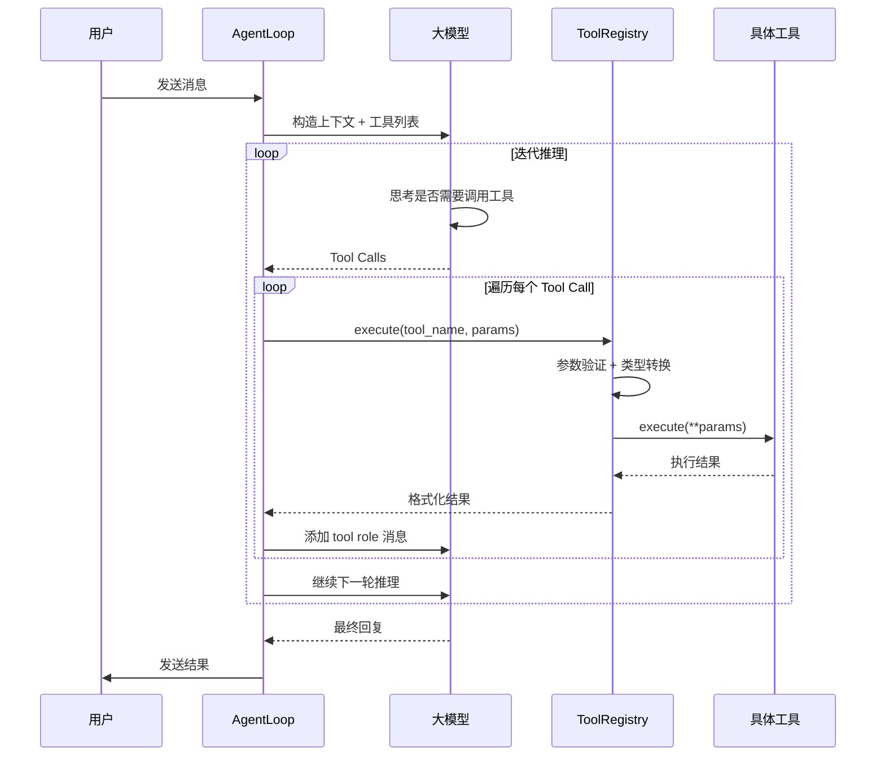

# 🛠️ Nanobot Tools 源代码详解与 GUI 自动化指南

## 📋 目录

- [Tools 核心架构](#tools 核心架构)
- [内置工具源码解析](#内置工具源码解析)
- [权限与安全机制](#权限与安全机制)
- [如何实现"像人一样操作电脑"](#如何实现像人一样操作电脑)
- [GUI 自动化实战](#gui 自动化实战)

---

## 🎯 Tools 核心架构

### **设计哲学**

Nanobot 的 tools 系统设计遵循以下原则：

```
1. 抽象基类定义标准 (Tool Base Class)
    ↓
2. 具体工具实现功能 (Concrete Tools)
    ↓
3. 注册表统一管理 (Tool Registry)
    ↓
4. Agent Loop 调用执行 (Agent Execution)
```

---

### **核心组件**

#### **1. Tool 基类 - 所有工具的抽象**

```python
# nanobot/agent/tools/base.py
class Tool(ABC):
    """Abstract base class for agent tools."""
    
    @property
    @abstractmethod
    def name(self) -> str:
        """Tool name used in function calls."""
        pass
    
    @property
    @abstractmethod
    def description(self) -> str:
        """Description of what the tool does."""
        pass
    
    @property
    @abstractmethod
    def parameters(self) -> dict[str, Any]:
        """JSON Schema for tool parameters."""
        pass
    
    @abstractmethod
    async def execute(self, **kwargs: Any) -> str:
        """Execute the tool with given parameters."""
        pass
    
    # 内置参数验证和类型转换
    def cast_params(self, params: dict[str, Any]) -> dict[str, Any]:
        """Apply safe schema-driven casts before validation."""
        pass
    
    def validate_params(self, params: dict[str, Any]) -> list[str]:
        """Validate tool parameters against JSON schema."""
        pass
    
    def to_schema(self) -> dict[str, Any]:
        """Convert tool to OpenAI function schema format."""
        return {
            "type": "function",
            "function": {
                "name": self.name,
                "description": self.description,
                "parameters": self.parameters,
            },
        }
```

**关键设计**:
- ✅ **接口标准化**: 所有工具必须实现 `name`, `description`, `parameters`, `execute`
- ✅ **OpenAI 兼容**: `to_schema()` 直接输出 LLM Function Calling 格式
- ✅ **参数验证**: 内置 JSON Schema 验证器
- ✅ **类型安全**: 自动类型转换和校验

---

#### **2. Tool Registry - 工具注册表**

```python
# nanobot/agent/tools/registry.py
class ToolRegistry:
    """Registry for agent tools."""
    
    def __init__(self):
        self._tools: dict[str, Tool] = {}
    
    def register(self, tool: Tool) -> None:
        """Register a tool."""
        self._tools[tool.name] = tool
    
    async def execute(self, name: str, params: dict[str, Any]) -> str:
        """Execute a tool by name with given parameters."""
        tool = self._tools.get(name)
        if not tool:
            return f"Error: Tool '{name}' not found"
        
        # 1. 参数类型转换
        params = tool.cast_params(params)
        
        # 2. 参数验证
        errors = tool.validate_params(params)
        if errors:
            return f"Error: Invalid parameters: " + "; ".join(errors)
        
        # 3. 执行工具
        result = await tool.execute(**params)
        
        # 4. 错误处理
        if isinstance(result, str) and result.startswith("Error"):
            return result + "\n\n[Analyze the error above and try a different approach.]"
        
        return result
    
    def get_definitions(self) -> list[dict[str, Any]]:
        """Get all tool definitions in OpenAI format."""
        return [tool.to_schema() for tool in self._tools.values()]
```

**作用**:
- ✅ **集中管理**: 所有工具统一注册和查询
- ✅ **动态扩展**: 运行时可以添加/删除工具
- ✅ **错误提示**: 自动添加改进建议给 LLM

---

#### **3. Agent Loop - 工具调度中心**

```python
# nanobot/agent/loop.py
class AgentLoop:
    """The agent loop is the core processing engine."""
    
    def __init__(self, ...):
        self.tools = ToolRegistry()
        self._register_default_tools()  # 注册默认工具
        
    def _register_default_tools(self) -> None:
        """Register the default set of tools."""
        allowed_dir = self.workspace if self.restrict_to_workspace else None
        
        # 文件操作工具
        self.tools.register(ReadFileTool(
            workspace=self.workspace, 
            allowed_dir=allowed_dir
        ))
        self.tools.register(WriteFileTool(...))
        self.tools.register(EditFileTool(...))
        self.tools.register(ListDirTool(...))
        
        # Shell 执行工具
        self.tools.register(ExecTool(
            working_dir=str(self.workspace),
            timeout=self.exec_config.timeout,
            restrict_to_workspace=self.restrict_to_workspace,
        ))
        
        # Web 工具
        self.tools.register(WebSearchTool(...))
        self.tools.register(WebFetchTool(...))
        
        # 消息和子 Agent
        self.tools.register(MessageTool(...))
        self.tools.register(SpawnTool(...))
        
        # 定时任务
        if self.cron_service:
            self.tools.register(CronTool(self.cron_service))
    
    async def _run_agent_loop(self, initial_messages: list[dict]) -> tuple[str, list[str], list[dict]]:
        """Run the agent iteration loop."""
        messages = initial_messages
        iteration = 0
        
        while iteration < self.max_iterations:
            # 1. 获取所有工具定义
            tool_defs = self.tools.get_definitions()
            
            # 2. 调用 LLM
            response = await self.provider.chat_with_retry(
                messages=messages,
                tools=tool_defs,  # ← 传给 LLM
                model=self.model,
            )
            
            if response.has_tool_calls:
                # 3. 执行工具调用
                for tool_call in response.tool_calls:
                    result = await self.tools.execute(
                        tool_call.name, 
                        tool_call.arguments
                    )
                    
                    # 4. 将结果加入对话
                    messages = self.context.add_tool_result(
                        messages, 
                        tool_call.id, 
                        tool_call.name, 
                        result
                    )
            else:
                # 没有工具调用，返回最终回复
                final_content = response.content
                break
        
        return final_content, tools_used, messages
```

**完整流程**:


---

## 📁 内置工具源码解析

### **1. ExecTool - 执行 Shell 命令**

```python
# nanobot/agent/tools/shell.py
class ExecTool(Tool):
    """Tool to execute shell commands."""
    
    def __init__(
        self,
        timeout: int = 60,
        working_dir: str | None = None,
        deny_patterns: list[str] | None = None,  # ← 危险命令黑名单
        allow_patterns: list[str] | None = None,  # ← 可选白名单
        restrict_to_workspace: bool = False,      # ← 限制在工作空间
        path_append: str = "",                    # ← 追加 PATH
    ):
        self.timeout = timeout
        self.deny_patterns = deny_patterns or [
            r"\brm\s+-[rf]{1,2}\b",          # rm -rf
            r"\bdel\s+/[fq]\b",              # del /q
            r"\brmdir\s+/s\b",               # rmdir /s
            r"(?:^|[;&|]\s*)format\b",       # format
            r"\b(mkfs|diskpart)\b",          # 磁盘操作
            r"\bdd\s+if=",                   # dd
            r">\s*/dev/sd",                  # 写磁盘
            r"\b(shutdown|reboot|poweroff)\b",  # 关机重启
            r":\(\)\s*\{.*\};\s*:",          # fork bomb
        ]
    
    async def execute(
        self, 
        command: str, 
        working_dir: str | None = None,
        timeout: int | None = None, 
        **kwargs: Any,
    ) -> str:
        # 1. 安全检查
        guard_error = self._guard_command(command, cwd)
        if guard_error:
            return guard_error  # ← 被黑名单拦截
        
        # 2. 设置超时
        effective_timeout = min(timeout or self.timeout, 600)  # 最多 600 秒
        
        # 3. 设置环境变量
        env = os.environ.copy()
        if self.path_append:
            env["PATH"] = env.get("PATH", "") + os.pathsep + self.path_append
        
        # 4. 创建子进程
        process = await asyncio.create_subprocess_shell(
            command,
            stdout=asyncio.subprocess.PIPE,
            stderr=asyncio.subprocess.PIPE,
            cwd=cwd,
            env=env,
        )
        
        # 5. 等待完成（带超时）
        try:
            stdout, stderr = await asyncio.wait_for(
                process.communicate(),
                timeout=effective_timeout,
            )
        except asyncio.TimeoutError:
            process.kill()
            return f"Error: Command timed out after {effective_timeout} seconds"
        
        # 6. 格式化输出
        output_parts = []
        if stdout:
            output_parts.append(stdout.decode("utf-8", errors="replace"))
        if stderr:
            output_parts.append(f"STDERR:\n{stderr_text}")
        output_parts.append(f"\nExit code: {process.returncode}")
        
        # 7. 截断过长输出
        result = "\n".join(output_parts)
        if len(result) > 10_000:
            half = 10_000 // 2
            result = result[:half] + f"\n... ({len(result) - 10_000:,} chars truncated) ...\n" + result[-half:]
        
        return result
    
    def _guard_command(self, command: str, cwd: str) -> str | None:
        """Best-effort safety guard for potentially destructive commands."""
        cmd = command.strip()
        lower = cmd.lower()
        
        # 黑名单检查
        for pattern in self.deny_patterns:
            if re.search(pattern, lower):
                return "Error: Command blocked by safety guard (dangerous pattern detected)"
        
        # 白名单检查（如果配置了）
        if self.allow_patterns:
            if not any(re.search(p, lower) for p in self.allow_patterns):
                return "Error: Command blocked by safety guard (not in allowlist)"
        
        # 内网 URL 检查
        from nanobot.security.network import contains_internal_url
        if contains_internal_url(cmd):
            return "Error: Command blocked (internal/private URL detected)"
        
        # 路径穿越检查
        if self.restrict_to_workspace:
            if "..\\" in cmd or "../" in cmd:
                return "Error: Command blocked (path traversal detected)"
            
            # 检查绝对路径是否在工作空间外
            cwd_path = Path(cwd).resolve()
            for raw in self._extract_absolute_paths(cmd):
                p = Path(raw.strip()).expanduser().resolve()
                if p.is_absolute() and cwd_path not in p.parents and p != cwd_path:
                    return "Error: Command blocked (path outside working dir)"
        
        return None  # 通过所有检查
```

**安全特性**:
- ✅ **黑名单机制**: 9 类危险命令直接拦截
- ✅ **白名单机制**: 可选，只允许特定命令
- ✅ **超时保护**: 默认 60 秒，最长 600 秒
- ✅ **路径限制**: 可限制只能访问工作空间
- ✅ **输出截断**: 防止过长输出淹没对话
- ✅ **内网保护**: 禁止访问内网 URL

---

### **2. FileSystem Tools - 文件操作**

#### **ReadFileTool - 读取文件**

```python
class ReadFileTool(_FsTool):
    """Read file contents with optional line-based pagination."""
    
    _MAX_CHARS = 128_000  # 最多 12.8 万字符
    _DEFAULT_LIMIT = 2000  # 默认读 2000 行
    
    async def execute(
        self, 
        path: str, 
        offset: int = 1, 
        limit: int | None = None, 
        **kwargs: Any
    ) -> str:
        fp = self._resolve(path)  # ← 解析并检查权限
        
        if not fp.exists():
            return f"Error: File not found: {path}"
        
        # 读取所有行
        all_lines = fp.read_text(encoding="utf-8").splitlines()
        total = len(all_lines)
        
        # 分页计算
        start = offset - 1
        end = min(start + (limit or self._DEFAULT_LIMIT), total)
        
        # 添加行号
        numbered = [f"{start + i + 1}| {line}" for i, line in enumerate(all_lines[start:end])]
        result = "\n".join(numbered)
        
        # 超长截断
        if len(result) > self._MAX_CHARS:
            # 保留开头和结尾
            result = result[:64000] + "\n... (truncated) ...\n" + result[-64000:]
        
        # 提示还有多少内容
        if end < total:
            result += f"\n\n(Showing lines {offset}-{end} of {total}. Use offset={end + 1} to continue.)"
        else:
            result += f"\n\n(End of file — {total} lines total)"
        
        return result
```

**亮点**:
- ✅ **行号显示**: 每行都有行号，方便引用
- ✅ **分页读取**: 支持 offset/limit 参数
- ✅ **智能截断**: 保留首尾，中间用省略号
- ✅ **继续阅读提示**: 告诉用户如何读取剩余内容

---

#### **EditFileTool - 编辑文件**

```python
class EditFileTool(_FsTool):
    """Edit a file by replacing text with fallback matching."""
    
    async def execute(
        self, 
        path: str, 
        old_text: str, 
        new_text: str,
        replace_all: bool = False, 
        **kwargs: Any,
    ) -> str:
        fp = self._resolve(path)
        
        # 读取文件（保留原始换行符）
        raw = fp.read_bytes()
        uses_crlf = b"\r\n" in raw  # ← Windows vs Unix
        content = raw.decode("utf-8").replace("\r\n", "\n")
        
        # 查找匹配文本
        match, count = _find_match(content, old_text.replace("\r\n", "\n"))
        
        if match is None:
            # 没找到，提供差异对比
            return self._not_found_msg(old_text, content, path)
        
        if count > 1 and not replace_all:
            return (
                f"Warning: old_text appears {count} times. "
                "Provide more context to make it unique, or set replace_all=true."
            )
        
        # 替换（保留原始换行符）
        norm_new = new_text.replace("\r\n", "\n")
        new_content = content.replace(match, norm_new, 1) if not replace_all else content.replace(match, norm_new)
        
        if uses_crlf:
            new_content = new_content.replace("\n", "\r\n")
        
        fp.write_bytes(new_content.encode("utf-8"))
        return f"Successfully edited {fp}"
    
    @staticmethod
    def _find_match(content: str, old_text: str) -> tuple[str | None, int]:
        """Locate old_text: exact first, then line-trimmed sliding window."""
        # 1. 精确匹配
        if old_text in content:
            return old_text, content.count(old_text)
        
        # 2. 按行模糊匹配（忽略缩进差异）
        old_lines = old_text.splitlines()
        stripped_old = [l.strip() for l in old_lines]
        content_lines = content.splitlines()
        
        # 滑动窗口查找
        for i in range(len(content_lines) - len(stripped_old) + 1):
            window = content_lines[i : i + len(stripped_old)]
            if [l.strip() for l in window] == stripped_old:
                return "\n".join(window), 1
        
        return None, 0
    
    @staticmethod
    def _not_found_msg(old_text: str, content: str, path: str) -> str:
        """没找到时，提供最佳匹配的差异对比。"""
        # 使用 difflib 找最相似的片段
        best_ratio, best_start = 0.0, 0
        for i in range(max(1, len(lines) - window + 1)):
            ratio = difflib.SequenceMatcher(None, old_lines, lines[i : i + window]).ratio()
            if ratio > best_ratio:
                best_ratio, best_start = ratio, i
        
        if best_ratio > 0.5:
            diff = "\n".join(difflib.unified_diff(
                old_lines, 
                lines[best_start : best_start + window],
                fromfile="old_text (provided)",
                tofile=f"{path} (actual, line {best_start + 1})",
            ))
            return f"Error: old_text not found.\nBest match ({best_ratio:.0%} similar) at line {best_start + 1}:\n{diff}"
        
        return f"Error: old_text not found in {path}. No similar text found."
```

**智能特性**:
- ✅ **容错匹配**: 不要求完全一致，忽略缩进和空白
- ✅ **多匹配警告**: 如果出现多次，提示用户提供更多上下文
- ✅ **差异对比**: 没找到时显示最相似的片段
- ✅ **跨平台**: 自动处理 CRLF/LF 换行符

---

### **3. Web Tools - 网络操作**

#### **WebSearchTool - 搜索互联网**

```python
# nanobot/agent/tools/web.py
class WebSearchTool(Tool):
    """Search the web using Tavily API."""
    
    def __init__(self, config: WebSearchConfig, proxy: str | None = None):
        self.config = config
        self.proxy = proxy
    
    @property
    def name(self) -> str:
        return "web_search"
    
    @property
    def description(self) -> str:
        return "Search the web for current information on any topic"
    
    @property
    def parameters(self) -> dict[str, Any]:
        return {
            "type": "object",
            "properties": {
                "query": {
                    "type": "string", 
                    "description": "The search query"
                },
                "max_results": {
                    "type": "integer",
                    "description": "Maximum number of results (default 5)",
                    "minimum": 1,
                    "maximum": 10,
                },
            },
            "required": ["query"],
        }
    
    async def execute(self, query: str, max_results: int = 5, **kwargs) -> str:
        # 使用 Tavily API 搜索
        async with httpx.AsyncClient(proxy=self.proxy) as client:
            response = await client.post(
                "https://api.tavily.com/search",
                json={
                    "api_key": self.config.api_key,
                    "query": query,
                    "max_results": max_results,
                },
            )
            
            data = response.json()
            results = []
            
            for result in data.get("results", []):
                results.append(f"**{result['title']}**\n{result['content']}\nURL: {result['url']}")
            
            return "\n\n".join(results) if results else "No results found"
```

---

## 🔒 权限与安全机制

### **权限来源**

Nanobot 的工具权限来自三个层面：

#### **1. Python 进程权限（操作系统层）**

```python
# exec 工具执行 Shell 命令
process = await asyncio.create_subprocess_shell(command, ...)
```

**权限级别**:
- ✅ **继承父进程权限**: nanobot 以什么用户运行，就有什么权限
- ✅ **文件系统访问**: 可读写当前用户有权限的所有文件
- ✅ **网络访问**: 可发起 HTTP 请求、Socket 连接等
- ✅ **进程创建**: 可启动其他程序

**实际测试**:
```bash
# Windows 示例
# 如果以管理员身份运行 nanobot
nanobot gateway

# 在对话中执行
"删除系统文件"
→ exec(command="del C:\\Windows\\System32\\config\\SAM")
→ ❌ 即使管理员也可能被 Windows Defender 拦截

# 普通用户运行
→ exec(command="dir C:\\Users\\")  
→ ✅ 成功（用户有读取权限）
```

---

#### **2. 应用层安全限制（代码层）**

```python
# ExecTool 的安全检查
def _guard_command(self, command: str, cwd: str) -> str | None:
    # 黑名单拦截
    for pattern in self.deny_patterns:
        if re.search(pattern, command):
            return "Blocked!"
    
    # 路径穿越检查
    if "..\\" in command or "../" in command:
        return "Path traversal blocked!"
    
    # 内网 URL 检查
    if contains_internal_url(command):
        return "Internal URL blocked!"
    
    return None  # 通过检查
```

**拦截示例**:
```python
# ❌ 会被拦截的命令
exec("rm -rf /")           # → Blocked by regex
exec("format C:")          # → Blocked by regex
exec("curl 192.168.1.1")   # → Blocked by internal URL check
exec("cat ../../etc/passwd") # → Blocked by path traversal

# ✅ 可以通过的命令
exec("ls -la")             # → OK
exec("git status")         # → OK
exec("python test.py")     # → OK (如果在工作空间内)
```

---

#### **3. 工作空间限制（可选配置）**

```json
// config.json
{
  "agents": {
    "defaults": {
      "workspace": "~/.nanobot/workspace",
      "restrictToWorkspace": true  // ← 启用工作空间限制
    }
  }
}
```

**效果**:
```python
# 启用后
exec("cat /etc/passwd")  # → Error: path outside working dir
exec("ls ~/.nanobot/")   # → OK (在工作空间内)
```

---

### **安全最佳实践**

#### **配置建议**

```json
{
  "tools": {
    "exec": {
      "timeout": 60,                    // 超时 60 秒
      "restrictToWorkspace": true,      // 限制在工作空间
      "denyPatterns": [                 // 自定义黑名单
        "rm -rf",
        "DROP TABLE",
        "DELETE FROM"
      ],
      "allowPatterns": [                // 可选：只允许特定命令
        "git .*",
        "npm .*",
        "python .*\\.py"
      ]
    }
  }
}
```

---

#### **运行时监控**

```python
# 记录所有工具调用
import logging

logging.basicConfig(level=logging.INFO)
logger = logging.getLogger("nanobot.tools")

# 每次工具调用都会记录
logger.info(f"Executing tool: {tool_name}, params: {params}")
```

**日志输出**:
```
INFO - Executing tool: exec, params: {'command': 'ls -la'}
INFO - Executing tool: write_file, params: {'path': '/tmp/test.txt', 'content': '...'}
WARNING - Blocked dangerous command: rm -rf /
```

---

## 🤖 如何实现"像人一样操作电脑"

### **现状分析**

**当前 Nanobot 的能力边界**:
```
✅ 已具备:
├─ 文件读写 (read_file, write_file, edit_file)
├─ Shell 执行 (exec)
├─ 网页浏览 (web_search, web_fetch)
├─ 子 Agent 创建 (spawn)
└─ 定时任务 (cron)

❌ 缺失:
├─ 屏幕截图能力
├─ 鼠标控制能力
├─ 键盘输入模拟
├─ GUI 元素识别
└─ 应用程序交互
```

---

### **为什么需要额外开发？**

#### **1. 操作系统隔离**

```python
# 当前 exec 工具可以执行任何 Shell 命令
exec("notepad.exe")  # → 启动记事本，但无法控制它

# 问题：
# - 无法看到记事本窗口
# - 无法点击"文件"菜单
# - 无法输入文字
# - 无法保存文件
```

**原因**:
- ✅ Shell 命令是**异步执行**的
- ✅ 启动的 GUI 程序独立运行
- ✅ Python 进程无法直接控制其他进程的窗口

---

#### **2. 缺少视觉反馈**

```
人类操作电脑的流程:
1. 眼睛看屏幕 → 识别按钮位置
2. 大脑处理 → "这是保存按钮"
3. 手移动鼠标 → 定位到按钮
4. 点击鼠标左键 → 触发事件

Nanobot 当前状态:
❌ 没有"眼睛"（屏幕捕获）
❌ 没有"手"（鼠标键盘模拟）
❌ 只有"嘴巴"（Shell 命令）
```

---

### **解决方案：添加 GUI 自动化工具**

#### **方案 1: PyAutoGUI（推荐入门）**

**安装**:
```bash
pip install pyautogui pillow
```

**创建工具**:
```python
# nanobot/agent/tools/gui.py
import pyautogui
from PIL import ImageGrab
from nanobot.agent.tools.base import Tool


class ScreenCaptureTool(Tool):
    """截取屏幕图像."""
    
    @property
    def name(self) -> str:
        return "screen_capture"
    
    @property
    def description(self) -> str:
        return "Capture the current screen and return as image"
    
    @property
    def parameters(self) -> dict[str, Any]:
        return {
            "type": "object",
            "properties": {
                "region": {
                    "type": "array",
                    "description": "Optional region [x, y, width, height]",
                    "items": {"type": "integer"},
                },
            },
        }
    
    async def execute(self, region: list[int] | None = None, **kwargs) -> str:
        # 截取全屏
        screenshot = ImageGrab.grab(bbox=region) if region else ImageGrab.grab()
        
        # 保存到临时文件
        path = f"C:\\temp\\screenshot_{int(time.time())}.png"
        screenshot.save(path)
        
        return f"Screenshot saved to {path}"


class MouseClickTool(Tool):
    """模拟鼠标点击."""
    
    @property
    def name(self) -> str:
        return "mouse_click"
    
    @property
    def description(self) -> str:
        return "Click mouse at specified coordinates"
    
    @property
    def parameters(self) -> dict[str, Any]:
        return {
            "type": "object",
            "properties": {
                "x": {"type": "integer", "description": "X coordinate"},
                "y": {"type": "integer", "description": "Y coordinate"},
                "button": {
                    "type": "string", 
                    "enum": ["left", "right", "middle"],
                    "default": "left",
                },
                "clicks": {
                    "type": "integer", 
                    "default": 1,
                    "minimum": 1,
                },
            },
            "required": ["x", "y"],
        }
    
    async def execute(
        self, 
        x: int, 
        y: int, 
        button: str = "left", 
        clicks: int = 1,
        **kwargs
    ) -> str:
        pyautogui.click(x=x, y=y, button=button, clicks=clicks)
        return f"Clicked at ({x}, {y})"


class KeyboardTypeTool(Tool):
    """模拟键盘输入."""
    
    @property
    def name(self) -> str:
        return "keyboard_type"
    
    @property
    def description(self) -> str:
        return "Type text on keyboard"
    
    @property
    def parameters(self) -> dict[str, Any]:
        return {
            "type": "object",
            "properties": {
                "text": {"type": "string", "description": "Text to type"},
                "interval": {
                    "type": "number", 
                    "description": "Delay between keystrokes (seconds)",
                    "default": 0.1,
                },
            },
            "required": ["text"],
        }
    
    async def execute(self, text: str, interval: float = 0.1, **kwargs) -> str:
        pyautogui.typewrite(text, interval=interval)
        return f"Typed: {text}"


class FindImageOnScreenTool(Tool):
    """在屏幕上查找图像."""
    
    @property
    def name(self) -> str:
        return "find_image_on_screen"
    
    @property
    def description(self) -> str:
        return "Find an image on screen and return its coordinates"
    
    @property
    def parameters(self) -> dict[str, Any]:
        return {
            "type": "object",
            "properties": {
                "image_path": {
                    "type": "string", 
                    "description": "Path to template image",
                },
                "confidence": {
                    "type": "number", 
                    "description": "Match confidence (0-1, default 0.9)",
                    "minimum": 0,
                    "maximum": 1,
                },
            },
            "required": ["image_path"],
        }
    
    async def execute(self, image_path: str, confidence: float = 0.9, **kwargs) -> str:
        location = pyautogui.locateOnScreen(image_path, confidence=confidence)
        
        if location:
            x, y = pyautogui.center(location)
            return f"Found at ({x}, {y})"
        else:
            return "Image not found on screen"
```

**注册到 Agent**:
```python
# nanobot/agent/loop.py
def _register_default_tools(self) -> None:
    # ... 现有工具 ...
    
    # 添加 GUI 工具
    self.tools.register(ScreenCaptureTool())
    self.tools.register(MouseClickTool())
    self.tools.register(KeyboardTypeTool())
    self.tools.register(FindImageOnScreenTool())
```

---

#### **方案 2: OpenCV + 图像识别（更强大）**

**安装**:
```bash
pip install opencv-python numpy mss
```

**增强工具**:
```python
import cv2
import numpy as np
import mss


class AdvancedScreenCaptureTool(Tool):
    """高性能屏幕捕获（支持多显示器）."""
    
    async def execute(self, monitor_id: int = 1, **kwargs) -> str:
        with mss.mss() as sct:
            # 获取指定显示器
            monitor = sct.monitors[monitor_id]
            screenshot = sct.grab(monitor)
            
            # 转换为 OpenCV 格式
            img = np.array(screenshot)
            img = cv2.cvtColor(img, cv2.COLOR_BGRA2BGR)
            
            # 保存
            path = f"C:\\temp\\screen_{int(time.time())}.jpg"
            cv2.imwrite(path, img)
            
            return f"Screenshot saved: {path}"


class FindButtonByOCRTool(Tool):
    """使用 OCR 识别屏幕上的按钮."""
    
    async def execute(self, text: str, **kwargs) -> str:
        import easyocr
        
        # 截屏
        screenshot = ImageGrab.grab()
        img_np = np.array(screenshot)
        
        # OCR 识别
        reader = easyocr.Reader(['ch_sim', 'en'])
        results = reader.readtext(img_np)
        
        # 查找匹配的文本
        for (bbox, detected_text, prob) in results:
            if text.lower() in detected_text.lower():
                # 计算中心点
                (top_left, top_right, bottom_right, bottom_left) = bbox
                center_x = int((top_left[0] + bottom_right[0]) / 2)
                center_y = int((top_left[1] + bottom_right[1]) / 2)
                
                return f"Found '{text}' at ({center_x}, {center_y})"
        
        return f"Text '{text}' not found on screen"
```

---

#### **方案 3: Computer Use API（最前沿）**

参考 Anthropic 的 Computer Use 项目：

```python
# 基于 https://github.com/anthropics/anthropic-quickstarts/tree/main/computer-use-demo

class ComputerUseTool(Tool):
    """Anthropic-style computer control."""
    
    @property
    def name(self) -> str:
        return "computer_use"
    
    @property
    def description(self) -> str:
        return "Control a computer through a GUI interface"
    
    @property
    def parameters(self) -> dict[str, Any]:
        return {
            "type": "object",
            "properties": {
                "action": {
                    "type": "string",
                    "enum": [
                        "key", "type", "mouse_move", 
                        "left_click", "right_click", "middle_click",
                        "double_click", "screenshot", "cursor_position"
                    ],
                },
                "text": {"type": "string"},
                "coordinate": {
                    "type": "array",
                    "items": {"type": "integer"},
                },
            },
            "required": ["action"],
        }
    
    async def execute(self, action: str, **kwargs) -> str:
        if action == "screenshot":
            # 截屏并返回 base64
            ...
        elif action == "left_click":
            pyautogui.click(x=kwargs["coordinate"][0], y=kwargs["coordinate"][1])
            ...
        # ... 其他动作
```

---

### **完整实战示例**

#### **场景：让 Nanobot 自动保存 Excel 文件**

**用户需求**:
> "帮我打开 D:\data.xlsx，修改 A1 单元格为'Hello'，然后保存"

**传统方式（仅 Shell）**:
```python
# 1. 用 openpyxl 库直接操作（编程方式）
exec("python -c \"from openpyxl import load_workbook; wb=load_workbook('D:/data.xlsx'); wb['A1'].value='Hello'; wb.save()\"")

# 缺点：
# - 看不到 Excel 界面
# - 无法处理复杂操作（如宏、图表）
# - 依赖 Python 库
```

**GUI 自动化方式**:
```python
# 1. 打开 Excel
exec("start excel D:\\data.xlsx")
await asyncio.sleep(3)  # 等待启动

# 2. 截屏查看
screen_path = await screen_capture()

# 3. 找到"开始"选项卡的位置
result = await find_image_on_screen(image_path="templates/home_tab.png")
# → "Found at (150, 50)"

# 4. 点击激活
await mouse_click(x=150, y=50)

# 5. 找到 A1 单元格（通过 OCR）
result = await find_button_by_ocr(text="A1")
# → "Found at (200, 300)"

# 6. 点击 A1
await mouse_click(x=200, y=300)

# 7. 输入文字
await keyboard_type(text="Hello")

# 8. 按 Ctrl+S 保存
await keyboard_type(text="s")  # 需要先模拟按下 Ctrl
# 或使用快捷键
pyautogui.hotkey('ctrl', 's')

# 9. 确认保存成功
await screen_capture()
```

**优势**:
- ✅ **可视化**: 每一步都能看到屏幕反馈
- ✅ **通用性**: 不依赖特定库，任何软件都能操作
- ✅ **灵活性**: 可以处理复杂 GUI 交互

---

## 🚀 GUI 自动化开发路线图

### **阶段 1: 基础能力（1-2 周）**

**目标**: 实现基本的鼠标键盘模拟

```python
# 工具清单
✅ ScreenCaptureTool       # 截屏
✅ MouseClickTool         # 点击
✅ KeyboardTypeTool       # 输入
✅ MouseMoveTool          # 移动
```

**测试用例**:
- [ ] 自动打开计算器
- [ ] 点击数字按钮
- [ ] 输入算式
- [ ] 截图验证结果

---

### **阶段 2: 图像识别（2-3 周）**

**目标**: 实现基于图像的按钮定位

```python
# 工具清单
✅ FindImageOnScreenTool   # 模板匹配
✅ FindButtonByOCRTool     # OCR 识别
✅ WaitForImageTool        # 等待图像出现
```

**测试用例**:
- [ ] 自动识别微信图标
- [ ] 双击打开微信
- [ ] 找到搜索框
- [ ] 输入联系人名字

---

### **阶段 3: 高级交互（3-4 周）**

**目标**: 复杂应用自动化

```python
# 工具清单
✅ WindowManagementTool    # 窗口管理
✅ ClipboardTool           # 剪贴板
✅ DragDropTool            # 拖拽操作
✅ ScrollTool              # 滚动
```

**测试用例**:
- [ ] 自动填写网页表单
- [ ] 上传附件到邮件
- [ ] 操作 Photoshop 修图

---

### **阶段 4: AI 视觉（4-6 周）**

**目标**: 结合多模态大模型

```python
# 集成 VLM（Vision Language Model）
class VLMBasedGUITool(Tool):
    """Use GPT-4V/Claude to analyze screen."""
    
    async def execute(self, instruction: str, **kwargs) -> str:
        # 1. 截屏
        screenshot = capture_screen()
        
        # 2. 发送给 VLM
        response = await vlm.chat(
            messages=[{
                "role": "user",
                "content": [
                    {"type": "text", "text": instruction},
                    {"type": "image_url", "image_url": screenshot}
                ]
            }]
        )
        
        # 3. 解析 VLM 返回的动作
        # "Click the blue button at (450, 300)"
        action = parse_action(response)
        
        # 4. 执行动作
        return await execute_action(action)
```

**测试用例**:
- [ ] "帮我发微信给张三说晚上一起吃饭"
  - VLM 识别微信界面
  - 找到搜索框
  - 输入"张三"
  - 点击聊天窗口
  - 输入文字
  - 发送

---

## ⚠️ 安全与伦理考量

### **风险点**

#### **1. 权限过大**

```python
# 如果恶意使用
exec("rm -rf ~/*")          # 删除所有文件
keyboard_type(text="malware.exe")  # 下载恶意软件
mouse_click(...)            # 误操作重要按钮
```

**防御措施**:
- ✅ **操作前确认**: 每次 GUI 操作前询问用户
- ✅ **操作录制**: 记录所有鼠标键盘动作
- ✅ **撤销机制**: 提供 Undo 功能
- ✅ **沙箱模式**: 在虚拟机中运行

---

#### **2. 隐私泄露**

```python
# 截屏可能包含敏感信息
screen_capture()  # → 拍到密码、聊天记录等
```

**防御措施**:
- ✅ **本地处理**: 图片不上传云端
- ✅ **自动打码**: 识别并模糊敏感区域
- ✅ **用户授权**: 每次截屏前通知

---

#### **3. 误操作风险**

```python
# AI 判断错误
mouse_click(x=100, y=200)  # 点错了地方
# → 可能删除了重要文件
```

**防御措施**:
- ✅ **慢速模式**: 每个动作间隔 2-3 秒
- ✅ **高亮显示**: 在点击位置画红圈
- ✅ **二次确认**: 危险操作（删除、发送）需确认

---

### **最佳实践清单**

```markdown
## 开发前

- [ ] 评估必要性：真的需要 GUI 自动化吗？
- [ ] 考虑替代方案：API/SDK 是否更简单？
- [ ] 风险评估：最坏情况是什么？

## 开发中

- [ ] 添加操作日志
- [ ] 实现撤销功能
- [ ] 设置操作频率限制
- [ ] 添加异常处理

## 部署后

- [ ] 用户培训：如何安全使用
- [ ] 监控审计：定期检查日志
- [ ] 紧急停止：一键终止所有操作
```

---

## 📝 总结

### **核心要点**

1. ✅ **当前 Tools 系统**: 强大的命令行和文件操作能力
2. ✅ **权限来源**: Python 进程权限 + 应用层安全检查
3. ✅ **GUI 自动化缺失**: 无法像人一样操作图形界面
4. ✅ **实现路径**: PyAutoGUI → OpenCV → VLM 多模态
5. ✅ **安全第一**: 权限控制、操作录制、紧急停止

---

### **下一步行动**

如果你想让 Nanobot 具备 GUI 操作能力：

**Step 1: 安装依赖**
```bash
pip install pyautogui pillow opencv-python mss easyocr
```

**Step 2: 创建工具文件**
```bash
# 创建 nanobot/agent/tools/gui.py
# 复制上面的工具代码
```

**Step 3: 注册工具**
```python
# 在 nanobot/agent/loop.py 的 _register_default_tools() 中添加
self.tools.register(ScreenCaptureTool())
self.tools.register(MouseClickTool())
# ...
```

**Step 4: 测试**
```bash
nanobot gateway

# 对话测试
"帮我截个图"
→ screen_capture()

"点击屏幕左上角"
→ mouse_click(x=100, y=100)
```

**Step 5: 逐步完善**
- 从简单的点击开始
- 添加图像识别
- 最终实现完整的桌面自动化

---

现在你完全理解 Tools 系统的运作机制和 GUI 自动化的实现方法了！🎉
